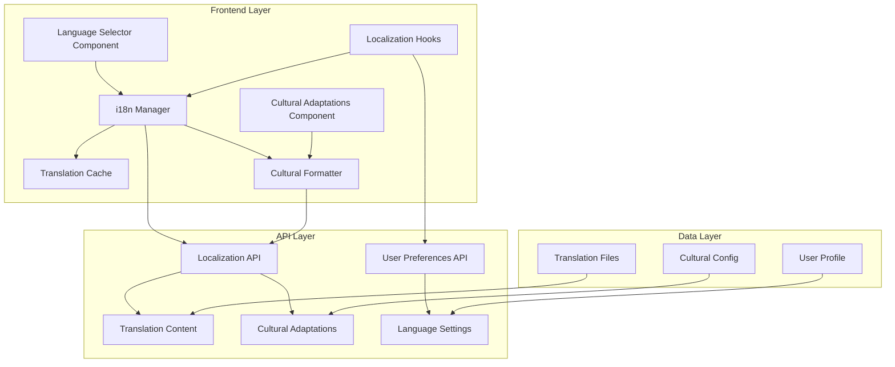
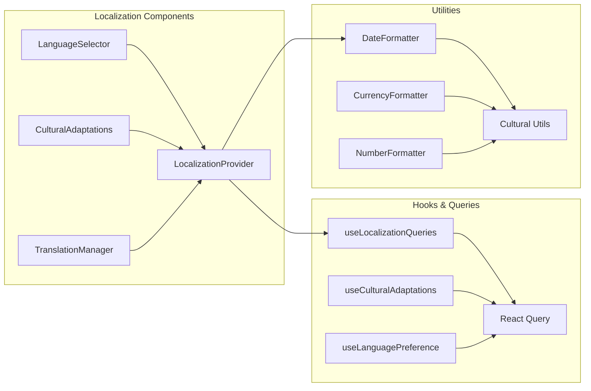

# German Localization and Cultural Adaptations - Design Document

## Overview

This design implements a comprehensive German localization system that extends the existing i18n infrastructure to provide full German language support with cultural adaptations for German-speaking countries (DE, AT, CH). The system leverages existing API endpoints and enhances the frontend with robust localization management, cultural formatting, and seamless language switching.

## Architecture

### High-Level Architecture



### Component Architecture



## Components and Interfaces

### 1. Core Localization Types

```typescript
// Enhanced localization types
interface Language {
  code: string;
  name: string;
  nativeName: string;
  flag: string;
  rtl?: boolean;
}

interface LocalizationContent {
  language: string;
  content: Record<string, string>;
  metadata: {
    version: string;
    lastUpdated: string;
    completeness: number;
  };
}

interface CulturalAdaptation {
  country: string;
  dateFormat: string;
  timeFormat: string;
  currency: string;
  currencySymbol: string;
  numberFormat: {
    decimal: string;
    thousands: string;
  };
  firstDayOfWeek: number;
  workingHours: {
    start: string;
    end: string;
  };
  holidays: Holiday[];
  pricing?: {
    currency: string;
    monthly: string;
    yearly: string;
  };
}

interface Holiday {
  name: string;
  date: string;
  type: 'national' | 'regional' | 'religious';
  description?: string;
}
```

### 2. Language Selector Component

**Purpose**: Provides intuitive language switching with visual feedback

**Features**:
- Dropdown and button variants
- Flag icons for visual identification
- Loading states during language changes
- Persistence of language preference
- Immediate UI updates

**Props Interface**:
```typescript
interface LanguageSelectorProps {
  variant?: 'dropdown' | 'buttons' | 'compact';
  showLabel?: boolean;
  showFlags?: boolean;
  className?: string;
  onLanguageChange?: (language: string) => void;
}
```

### 3. Cultural Adaptations Component

**Purpose**: Displays and manages cultural settings for German-speaking regions

**Features**:
- Country-specific adaptations (DE/AT/CH)
- Date/time format previews
- Currency formatting examples
- Holiday calendar integration
- Working hours configuration

**Key Sections**:
- Country selection interface
- Format settings display
- Holiday calendar
- Regional pricing information
- Business hour configurations

### 4. Localization Hooks

**useLocalizationQueries**:
```typescript
// Available languages query
const useAvailableLanguagesQuery = () => useQuery({
  queryKey: ['localization', 'languages'],
  queryFn: () => apiClient.getAvailableLanguages(),
  staleTime: 60 * 60 * 1000, // 1 hour
});

// Localization content query
const useLocalizationContentQuery = (language: string) => useQuery({
  queryKey: ['localization', 'content', language],
  queryFn: () => apiClient.getLocalizationContent(language),
  enabled: !!language,
  staleTime: 30 * 60 * 1000, // 30 minutes
});

// Cultural adaptations query
const useCulturalAdaptationsQuery = (country: string) => useQuery({
  queryKey: ['localization', 'cultural', country],
  queryFn: () => apiClient.getCulturalAdaptations(country),
  enabled: !!country,
  staleTime: 60 * 60 * 1000, // 1 hour
});

// Update language mutation
const useUpdateUserLanguageMutation = () => useMutation({
  mutationFn: (language: string) => apiClient.updateUserLanguage(language),
  onSuccess: (_, language) => {
    i18n.changeLanguage(language);
    queryClient.invalidateQueries(['auth']);
  },
});
```

### 5. Cultural Formatting Utilities

**DateFormatter**:
```typescript
class DateFormatter {
  constructor(private adaptations: CulturalAdaptation) {}
  
  formatDate(date: Date): string {
    return date.toLocaleDateString(this.getLocale(), {
      day: '2-digit',
      month: '2-digit',
      year: 'numeric'
    });
  }
  
  formatTime(date: Date): string {
    return date.toLocaleTimeString(this.getLocale(), {
      hour: '2-digit',
      minute: '2-digit',
      hour12: false
    });
  }
  
  private getLocale(): string {
    return this.adaptations.country === 'DE' ? 'de-DE' :
           this.adaptations.country === 'AT' ? 'de-AT' :
           this.adaptations.country === 'CH' ? 'de-CH' : 'de-DE';
  }
}
```

**CurrencyFormatter**:
```typescript
class CurrencyFormatter {
  constructor(private adaptations: CulturalAdaptation) {}
  
  formatCurrency(amount: number): string {
    return new Intl.NumberFormat(this.getLocale(), {
      style: 'currency',
      currency: this.adaptations.currency,
    }).format(amount);
  }
  
  formatNumber(number: number): string {
    return new Intl.NumberFormat(this.getLocale()).format(number);
  }
}
```

## Data Models

### Translation Structure

The German translations follow a hierarchical structure organized by feature areas:

```json
{
  "app": {
    "name": "Zeit & Wellness",
    "tagline": "Ihr persönlicher Produktivitäts- und Wellness-Begleiter"
  },
  "navigation": {
    "dashboard": "Dashboard",
    "tasks": "Aufgaben",
    "health": "Gesundheit",
    "calendar": "Kalender",
    "focus": "Fokus",
    "badges": "Abzeichen",
    "social": "Sozial",
    "voice": "Sprache",
    "analytics": "Analytik",
    "settings": "Einstellungen"
  },
  "auth": {
    "login": "Anmelden",
    "register": "Registrieren",
    "logout": "Abmelden",
    "email": "E-Mail",
    "password": "Passwort",
    "firstName": "Vorname",
    "lastName": "Nachname"
  },
  "tasks": {
    "title": "Aufgaben",
    "create_new": "Neue Aufgabe erstellen",
    "priority": {
      "urgent": "Dringend",
      "important": "Wichtig",
      "normal": "Normal",
      "low": "Niedrig"
    },
    "status": {
      "todo": "Zu erledigen",
      "in_progress": "In Bearbeitung",
      "completed": "Abgeschlossen"
    }
  },
  "health": {
    "title": "Gesundheitsverfolgung",
    "exercise": "Übung",
    "nutrition": "Ernährung",
    "mood": "Stimmung",
    "hydration": "Flüssigkeitszufuhr"
  },
  "common": {
    "save": "Speichern",
    "cancel": "Abbrechen",
    "delete": "Löschen",
    "edit": "Bearbeiten",
    "create": "Erstellen",
    "update": "Aktualisieren",
    "loading": "Laden...",
    "error": "Fehler",
    "success": "Erfolgreich",
    "confirm": "Bestätigen",
    "yes": "Ja",
    "no": "Nein"
  }
}
```

### Cultural Adaptations Data Model

```typescript
interface GermanCulturalAdaptations {
  DE: {
    country: 'DE';
    dateFormat: 'DD.MM.YYYY';
    timeFormat: 'HH:mm';
    currency: 'EUR';
    currencySymbol: '€';
    numberFormat: {
      decimal: ',';
      thousands: '.';
    };
    firstDayOfWeek: 1; // Monday
    workingHours: {
      start: '08:00';
      end: '17:00';
    };
    holidays: [
      { name: 'Neujahr', date: '2024-01-01', type: 'national' },
      { name: 'Tag der Deutschen Einheit', date: '2024-10-03', type: 'national' },
      // ... more holidays
    ];
    pricing: {
      currency: 'EUR';
      monthly: '9,99 €';
      yearly: '99,99 €';
    };
  };
  AT: {
    // Austrian-specific adaptations
  };
  CH: {
    // Swiss-specific adaptations
  };
}
```

## Error Handling

### Translation Fallback Strategy

1. **Primary**: Use requested German translation
2. **Secondary**: Fall back to English if German key missing
3. **Tertiary**: Display translation key with warning
4. **Logging**: Log missing translations for future updates

```typescript
const useTranslationWithFallback = (key: string) => {
  const { t, i18n } = useTranslation();
  
  const translate = useCallback((translationKey: string) => {
    const translation = t(translationKey);
    
    // Check if translation exists
    if (translation === translationKey) {
      // Log missing translation
      console.warn(`Missing translation for key: ${translationKey} in language: ${i18n.language}`);
      
      // Try English fallback
      const englishTranslation = t(translationKey, { lng: 'en' });
      return englishTranslation !== translationKey ? englishTranslation : translationKey;
    }
    
    return translation;
  }, [t, i18n.language]);
  
  return translate;
};
```

### API Error Handling

```typescript
const handleLocalizationError = (error: any, context: string) => {
  console.error(`Localization error in ${context}:`, error);
  
  // Show user-friendly error message
  const message = i18n.language === 'de' 
    ? 'Fehler beim Laden der Spracheinstellungen'
    : 'Error loading language settings';
    
  toast.error(message);
  
  // Fallback to cached data or default language
  return fallbackToDefault();
};
```

## Testing Strategy

### Unit Tests

1. **Translation Loading**: Test translation file loading and caching
2. **Language Switching**: Verify smooth language transitions
3. **Cultural Formatting**: Test date, time, and currency formatting
4. **Fallback Behavior**: Ensure proper fallbacks for missing translations
5. **Component Rendering**: Test all components in both languages

### Integration Tests

1. **API Integration**: Test localization API endpoints
2. **User Preference Persistence**: Verify language settings persistence
3. **Cultural Adaptations**: Test country-specific adaptations
4. **Cross-Component Communication**: Test language changes across components

### E2E Tests

1. **Complete User Journey**: Test full localization experience
2. **Language Switching Flow**: Test switching between English and German
3. **Cultural Settings**: Test cultural adaptations interface
4. **Mobile Responsiveness**: Test German text on mobile devices

### Test Data

```typescript
const mockGermanTranslations = {
  'navigation.dashboard': 'Dashboard',
  'navigation.tasks': 'Aufgaben',
  'common.save': 'Speichern',
  'common.cancel': 'Abbrechen',
};

const mockCulturalAdaptations = {
  country: 'DE',
  dateFormat: 'DD.MM.YYYY',
  timeFormat: 'HH:mm',
  currency: 'EUR',
  firstDayOfWeek: 1,
};
```

## Performance Considerations

### Translation Loading Strategy

1. **Lazy Loading**: Load translations on demand
2. **Caching**: Cache translations in localStorage
3. **Compression**: Use compressed translation files
4. **CDN**: Serve translations from CDN for faster loading

### Memory Management

1. **Translation Cleanup**: Remove unused translations from memory
2. **Component Optimization**: Use React.memo for translation components
3. **Bundle Splitting**: Split translations by feature areas

### Network Optimization

1. **Request Batching**: Batch localization API requests
2. **Caching Strategy**: Implement proper cache headers
3. **Offline Support**: Cache translations for offline use

## Implementation Phases

### Phase 1: Core Infrastructure
- Enhanced localization hooks
- Language selector component
- Basic German translations
- API integration

### Phase 2: Cultural Adaptations
- Cultural adaptations component
- Date/time/currency formatting
- Country-specific settings
- Holiday integration

### Phase 3: Advanced Features
- Translation management interface
- Advanced formatting utilities
- Performance optimizations
- Comprehensive testing

### Phase 4: Polish & Optimization
- UI/UX improvements
- Performance tuning
- Accessibility enhancements
- Documentation completion

## Security Considerations

1. **Input Validation**: Validate language codes and country codes
2. **XSS Prevention**: Sanitize translated content
3. **API Security**: Secure localization endpoints
4. **Data Privacy**: Handle user language preferences securely

## Accessibility

1. **Screen Reader Support**: Ensure German content works with screen readers
2. **Keyboard Navigation**: Maintain keyboard accessibility in German interface
3. **High Contrast**: Ensure German text is readable in high contrast mode
4. **Language Announcements**: Announce language changes to assistive technologies

This design provides a comprehensive foundation for implementing robust German localization with cultural adaptations while maintaining performance, accessibility, and user experience standards.