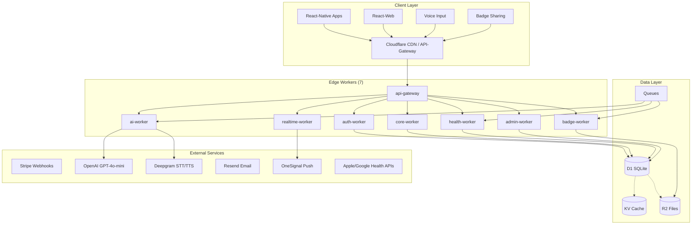
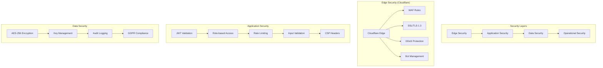
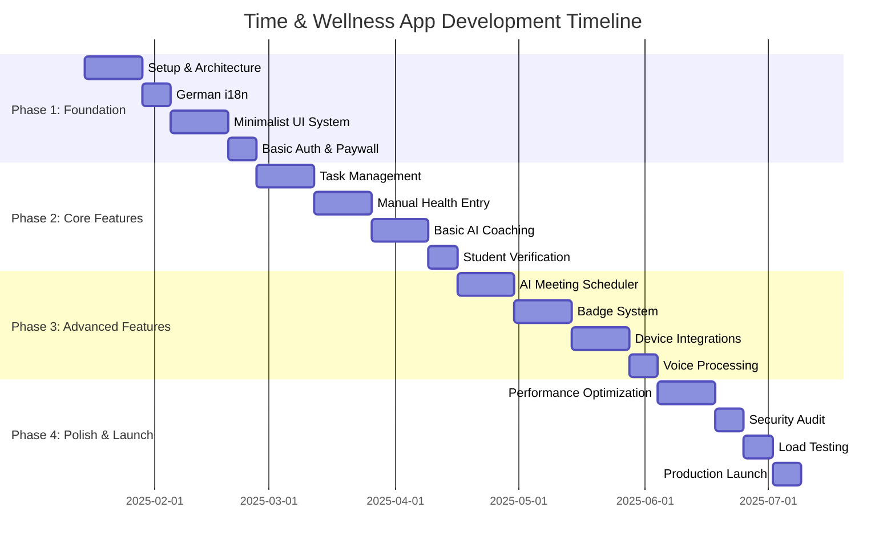

# 🏛️ TIME & WELLNESS APPLICATION - COMPLETE PROJECT ARCHITECTURE
**Target:** 100% Cloudflare Edge Deployment (Workers, D1, KV, R2, Queues)  
**Client:** React-Native (iOS/Android) + React-Web (Vite)  
**License:** Zero vendor lock-in beyond Cloudflare  
**Version:** 3.0 - Production Ready with German Support & Student Pricing  
**Last Updated:** January 2025

---

## 📑 TABLE OF CONTENTS

1. [Executive Summary & Product Vision](#1-executive-summary--product-vision)
2. [Technology Stack & Dependencies](#2-technology-stack--dependencies)
3. [System Architecture & Data Flow](#3-system-architecture--data-flow)
4. [Database Design & Schema](#4-database-design--schema)
5. [Backend Implementation (Cloudflare Workers)](#5-backend-implementation-cloudflare-workers)
6. [Frontend Implementation & UI Design](#6-frontend-implementation--ui-design)
7. [AI Integration & External Services](#7-ai-integration--external-services)
8. [Security, Privacy & Compliance](#8-security-privacy--compliance)
9. [Pricing, Paywall & Student Tiers](#9-pricing-paywall--student-tiers)
10. [Internationalization & Localization](#10-internationalization--localization)
11. [Performance & Scalability](#11-performance--scalability)
12. [CI/CD & Deployment Strategy](#12-cicd--deployment-strategy)
13. [Monitoring & Observability](#13-monitoring--observability)
14. [Implementation Roadmap](#14-implementation-roadmap)
15. [Quick Reference & Cheat Sheets](#15-quick-reference--cheat-sheets)

---

## 1. EXECUTIVE SUMMARY & PRODUCT VISION

### 1.1 Product Overview
A unified **Time & Wellness Management Application** with **13 integrated modules** covering:

**Productivity & Time Management:**
- **Module 1:** Task Management with AI prioritization and smart scheduling
- **Module 2:** Calendar & AI Meeting Scheduling with external sync
- **Module 3:** Focus & Deep Work Timer with Pomodoro and DND modes
- **Module 4:** Progress Reports & Analytics with AI pattern recognition

**Health & Fitness Tracking:**
- **Module 5:** Meal & Nutrition Logging with natural language + manual entry
- **Module 6:** Exercise & Activity Tracking with device integration + manual fallback
- **Module 7:** Water & Hydration with visual progress and smart reminders

**Wellness & Lifestyle:**
- **Module 8:** Break Reminders & Movement with screen time monitoring
- **Module 9:** Mood & Energy Tracking with pattern analysis
- **Module 10:** Habit Building with streak tracking and shareable badges

**Mindfulness & Personal Growth:**
- **Module 11:** Gratitude Journal with daily prompts and AI analysis
- **Module 12:** Daily Reflection & Journaling with voice-to-text
- **Module 13:** Goal Setting & Life Vision with AI milestone breakdown

### 1.2 Key Differentiators
- **Minimalist UI Design:** Maximum 3 primary actions per screen, generous white space
- **AI-Powered Insights:** Smart planning, health coaching, pattern analysis
- **Full German Support:** Complete localization with cultural adaptations
- **Shareable Achievements:** Social badges for motivation and community
- **Student-Friendly Pricing:** Discounted tiers with verification
- **Manual Entry Fallback:** Works without fitness devices

### 1.3 Technical Vision
- **100% Cloudflare Edge:** Zero vendor lock-in, global performance
- **Sub-200ms Response Times:** Optimized for mobile-first experience
- **99.9% Uptime:** Multi-region deployment with automatic failover
- **GDPR + HIPAA Grade Security:** End-to-end encryption and privacy controls

---

## 2. TECHNOLOGY STACK & DEPENDENCIES

### 2.1 Backend Infrastructure (Cloudflare Only)
```yaml
Platform: Cloudflare Workers (Serverless Edge)
Runtime: Node.js 18+ with V8 Engine
Language: TypeScript 5.0+
Framework: Hono.js (Fast & Lightweight)

Data Layer:
  Database: Cloudflare D1 (SQLite-based)
  Cache: Cloudflare KV Store  
  Storage: Cloudflare R2 Object Storage
  Queue: Cloudflare Queues
  Analytics: Cloudflare Analytics Engine
```

### 2.2 Frontend Technologies
```yaml
Mobile: React Native 0.72+ (iOS/Android)
Web: React 18+ with Vite
Language: TypeScript 5.0+
State: Zustand + React Query
UI: NativeBase (Mobile), Tailwind CSS (Web)
Navigation: React Navigation 6+
```

### 2.3 Key Dependencies
```json
{
  "backend": {
    "hono": "^3.12.0",
    "drizzle-orm": "^0.28.0",
    "@ai-sdk/openai": "^0.0.24",
    "deepgram-node-sdk": "^2.4.0",
    "stripe": "^13.5.0",
    "jose": "^4.15.0",
    "zod": "^3.22.0"
  },
  "frontend": {
    "react": "18.2.0",
    "react-native": "0.72.0",
    "zustand": "^4.4.0",
    "@tanstack/react-query": "^4.32.0",
    "i18next": "^23.5.0",
    "react-i18next": "^13.2.0",
    "react-native-svg": "^13.4.0",
    "react-native-share": "^8.2.2"
  }
}
```

### 2.4 Minimalist Design Principles
```yaml
UI Philosophy: "Simplicity First"
Design Rules:
  - Maximum 3 primary actions per screen
  - Single-tap interactions for common tasks
  - Generous white space (minimum 16px margins)
  - Clean typography (single font family: Inter)
  - Subtle animations (200ms duration max)
  - Color-coded modules for instant recognition
```

### 2.5 External Service Integrations
| Vendor | Purpose | Secrets Key |
|--------|---------|-------------|
| **OpenAI** | GPT-4o-mini coaching, planning | `OPENAI_API_KEY` |
| **Deepgram** | STT (Nova-2) & TTS (Aura) | `DEEPGRAM_API_KEY` |
| **Stripe** | Billing, student verification | `STRIPE_SECRET_KEY`, `STRIPE_WEBHOOK_SECRET` |
| **Resend** | Transactional emails | `RESEND_API_KEY` |
| **OneSignal** | Push notifications | `ONESIGNAL_APP_ID`, `ONESIGNAL_REST_KEY` |
| **Apple HealthKit** | Device data sync | OAuth tokens (encrypted) |
| **Google Fit** | Android fitness data | OAuth tokens (encrypted) |

---

## 3. SYSTEM ARCHITECTURE & DATA FLOW

### 3.1 High-Level Architecture



### 3.2 Cloudflare Resources & Limits
| Resource | Binding Name | Production ID | Limit | Mitigation |
|----------|--------------|---------------|-------|------------|
| Worker – api-gateway | – | `wellness-gateway` | 50ms CPU | Split heavy routes |
| Worker – auth-worker | – | `wellness-auth` | 50ms CPU | JWT optimization |
| Worker – core-worker | – | `wellness-core` | 50ms CPU | Query batching |
| Worker – health-worker | – | `wellness-health` | 50ms CPU | Device sync queues |
| Worker – ai-worker | – | `wellness-ai` | 50ms CPU | Circuit breakers |
| Worker – realtime-worker | – | `wellness-rt` | 50ms CPU | WebSocket pooling |
| Worker – admin-worker | – | `wellness-admin` | 50ms CPU | – |
| D1 Database | `DB` | `wellness_prod` | 100GB, 1GB query | Archive to R2 |
| KV Namespace | `CACHE` | `wellness_kv_prod` | 25MB value | TTL + pagination |
| R2 Bucket | `ASSETS` | `wellness-r2-prod` | – | Badge & voice storage |
| Queue | `TASK_QUEUE` | `wellness-task-queue` | 100 msg/s | Batch processing |
| Analytics Engine | `ANALYTICS` | – | 90-day retention | Export nightly |

### 3.3 Microservice Communication Pattern
```typescript
// Event-Driven Architecture
interface ServiceEvent {
  type: 'task.completed' | 'habit.logged' | 'achievement.unlocked' | 'badge.earned';
  userId: string;
  data: any;
  timestamp: number;
  correlationId: string;
  language: 'en' | 'de';
}

class EventBus {
  async publish(event: ServiceEvent): Promise<void> {
    // Route to appropriate queue
    await this.queues[this.getQueueForEvent(event.type)].send(event);
    
    // Broadcast real-time updates
    if (this.isRealTimeEvent(event.type)) {
      await this.realtimeService.broadcast(event);
    }
    
    // Generate badges if applicable
    if (this.shouldGenerateBadge(event.type)) {
      await this.badgeService.checkAndAward(event.userId, event.type);
    }
  }
}
```

---

## 4. DATABASE DESIGN & SCHEMA

### 4.1 Core Schema (D1 SQLite)

```sql
-- Users with internationalization support
CREATE TABLE users (
  id TEXT PRIMARY KEY,
  email TEXT UNIQUE NOT NULL,
  password_hash TEXT NOT NULL,
  first_name TEXT,
  last_name TEXT,
  timezone TEXT DEFAULT 'UTC',
  preferred_language TEXT DEFAULT 'en',
  subscription_type TEXT DEFAULT 'free',
  subscription_expires_at INTEGER,
  stripe_customer_id TEXT,
  is_student BOOLEAN DEFAULT false,
  student_verification_status TEXT DEFAULT 'none',
  created_at INTEGER NOT NULL,
  updated_at INTEGER NOT NULL
);

-- Tasks with AI enhancement
CREATE TABLE tasks (
  id TEXT PRIMARY KEY,
  user_id TEXT NOT NULL REFERENCES users(id),
  title TEXT NOT NULL,
  description TEXT,
  priority INTEGER NOT NULL DEFAULT 1,
  status TEXT DEFAULT 'pending',
  due_date INTEGER,
  estimated_duration INTEGER,
  ai_priority_score REAL,
  ai_planning_session_id TEXT,
  energy_level_required INTEGER,
  context_type TEXT,
  created_at INTEGER NOT NULL,
  updated_at INTEGER NOT NULL
);

-- Calendar events with AI scheduling
CREATE TABLE calendar_events (
  id TEXT PRIMARY KEY,
  user_id TEXT NOT NULL REFERENCES users(id),
  title TEXT NOT NULL,
  start INTEGER NOT NULL,
  "end" INTEGER NOT NULL,
  source TEXT CHECK(source IN ('manual','auto','google','outlook','icloud','ai_scheduled')),
  ai_generated BOOLEAN DEFAULT 0,
  meeting_participants JSON,
  ai_confidence_score REAL,
  created_at INTEGER NOT NULL
);

-- Health logs with manual entry support
CREATE TABLE health_logs (
  id TEXT PRIMARY KEY,
  user_id TEXT NOT NULL REFERENCES users(id),
  type TEXT CHECK(type IN ('exercise','nutrition','mood','hydration')) NOT NULL,
  payload JSON NOT NULL,
  recorded_at INTEGER NOT NULL,
  source TEXT CHECK(source IN ('auto','manual','device')) DEFAULT 'manual',
  device_type TEXT,
  created_at INTEGER NOT NULL
);

-- Enhanced achievement system
CREATE TABLE achievement_definitions (
  id TEXT PRIMARY KEY,
  achievement_key TEXT UNIQUE NOT NULL,
  category TEXT NOT NULL,
  title_en TEXT NOT NULL,
  title_de TEXT NOT NULL,
  description_en TEXT NOT NULL,
  description_de TEXT NOT NULL,
  criteria JSON NOT NULL,
  points_awarded INTEGER DEFAULT 0,
  badge_svg_template TEXT,
  rarity TEXT CHECK(rarity IN ('common','rare','epic','legendary')) DEFAULT 'common',
  is_active BOOLEAN DEFAULT true
);

-- User achievements with badges
CREATE TABLE user_achievements (
  id TEXT PRIMARY KEY,
  user_id TEXT NOT NULL REFERENCES users(id),
  achievement_key TEXT NOT NULL,
  is_unlocked BOOLEAN DEFAULT false,
  unlocked_at INTEGER,
  badge_svg_content TEXT,
  custom_message TEXT,
  share_count INTEGER DEFAULT 0,
  created_at INTEGER NOT NULL
);

-- Badge sharing system
CREATE TABLE badge_shares (
  id TEXT PRIMARY KEY,
  badge_id TEXT REFERENCES user_achievements(id),
  platform TEXT NOT NULL,
  shared_at INTEGER NOT NULL,
  click_count INTEGER DEFAULT 0,
  share_url TEXT
);

-- External OAuth tokens (encrypted)
CREATE TABLE external_tokens (
  user_id TEXT REFERENCES users(id),
  provider TEXT CHECK(provider IN ('google','outlook','apple','fitbit')) NOT NULL,
  access_token_enc TEXT NOT NULL,
  refresh_token_enc TEXT,
  expires_at INTEGER,
  PRIMARY KEY (user_id, provider)
);

-- Student verification system
CREATE TABLE student_verifications (
  id TEXT PRIMARY KEY,
  user_id TEXT REFERENCES users(id),
  verification_type TEXT CHECK(verification_type IN ('email','document')) NOT NULL,
  status TEXT CHECK(status IN ('pending','approved','rejected')) DEFAULT 'pending',
  submitted_documents JSON,
  admin_notes TEXT,
  verified_at INTEGER,
  expires_at INTEGER,
  created_at INTEGER NOT NULL
);

-- Localized content
CREATE TABLE localized_content (
  id TEXT PRIMARY KEY,
  content_key TEXT NOT NULL,
  language TEXT NOT NULL,
  content TEXT NOT NULL,
  created_at INTEGER NOT NULL,
  UNIQUE(content_key, language)
);

-- File assets (badges, voice recordings, exports)
CREATE TABLE file_assets (
  id TEXT PRIMARY KEY,
  user_id TEXT REFERENCES users(id),
  file_type TEXT NOT NULL,
  r2_key TEXT NOT NULL,
  r2_url TEXT NOT NULL,
  related_entity_id TEXT,
  content_type TEXT,
  file_size INTEGER,
  created_at INTEGER NOT NULL
);

-- AI planning sessions
CREATE TABLE smart_planning_sessions (
  id TEXT PRIMARY KEY,
  user_id TEXT NOT NULL REFERENCES users(id),
  natural_language_input TEXT NOT NULL,
  language TEXT DEFAULT 'en',
  context_data JSON,
  planned_tasks JSON NOT NULL,
  ai_confidence_score REAL,
  user_accepted BOOLEAN DEFAULT false,
  execution_success_rate REAL,
  created_at INTEGER NOT NULL
);

-- Meeting scheduling requests
CREATE TABLE meeting_requests (
  id TEXT PRIMARY KEY,
  organizer_id TEXT NOT NULL REFERENCES users(id),
  title TEXT NOT NULL,
  participants JSON NOT NULL,
  duration_minutes INTEGER NOT NULL,
  preferences JSON,
  ai_suggested_slots JSON,
  selected_slot JSON,
  status TEXT CHECK(status IN ('pending','scheduled','cancelled')) DEFAULT 'pending',
  created_at INTEGER NOT NULL
);
```

### 4.2 Indexes for Performance
```sql
-- Performance indexes
CREATE INDEX idx_users_email ON users(email);
CREATE INDEX idx_users_stripe_customer ON users(stripe_customer_id);
CREATE INDEX idx_tasks_user_status ON tasks(user_id, status);
CREATE INDEX idx_tasks_due_date ON tasks(due_date) WHERE due_date IS NOT NULL;
CREATE INDEX idx_health_logs_user_type ON health_logs(user_id, type);
CREATE INDEX idx_health_logs_recorded_at ON health_logs(recorded_at);
CREATE INDEX idx_calendar_events_user_time ON calendar_events(user_id, start, "end");
CREATE INDEX idx_achievements_user ON user_achievements(user_id);
CREATE INDEX idx_badge_shares_platform ON badge_shares(platform);
```

---

## 5. BACKEND IMPLEMENTATION (CLOUDFLARE WORKERS)

### 5.1 Project Structure
```
wellness-backend/
├── wrangler.toml
├── package.json
├── tsconfig.json
├── migrations/
│   ├── 001_init.sql
│   ├── 002_achievements.sql
│   ├── 003_badges.sql
│   └── seed.sql
├── src/
│   ├── workers/
│   │   ├── api-gateway.ts
│   │   ├── auth.ts
│   │   ├── core.ts
│   │   ├── health.ts
│   │   ├── ai.ts
│   │   ├── realtime.ts
│   │   ├── badges.ts
│   │   └── admin.ts
│   ├── lib/
│   │   ├── env.d.ts
│   │   ├── db.ts
│   │   ├── kv.ts
│   │   ├── encryption.ts
│   │   ├── jwt.ts
│   │   ├── paywall.ts
│   │   ├── ai.ts
│   │   ├── voice.ts
│   │   ├── badges.ts
│   │   ├── i18n.ts
│   │   ├── notifications.ts
│   │   └── logger.ts
│   ├── middleware/
│   │   ├── rateLimit.ts
│   │   ├── cors.ts
│   │   ├── language.ts
│   │   └── validate.ts
│   ├── schemas/
│   │   ├── auth.ts
│   │   ├── task.ts
│   │   ├── health.ts
│   │   ├── ai.ts
│   │   ├── badges.ts
│   │   └── calendar.ts
│   ├── utils/
│   │   ├── id.ts
│   │   ├── date.ts
│   │   └── errors.ts
│   └── jobs/
│       ├── index.ts
│       ├── analyzeTaskPriority.ts
│       ├── generateInsights.ts
│       ├── generateBadges.ts
│       ├── syncExternalCalendars.ts
│       └── sendNotification.ts
├── tests/
│   ├── unit/
│   └── integration/
├── scripts/
│   ├── dev.ts
│   ├── seed-stripe.js
│   └── deploy.sh
└── docs/
    ├── api.md
    └── runbooks.md
```

### 5.2 Core API Endpoints

```typescript
// Authentication & Users
POST   /auth/register
POST   /auth/login
POST   /auth/refresh
POST   /auth/verify-student
GET    /api/users/profile
PUT    /api/users/profile
PUT    /api/users/language

// Task Management with AI
GET    /api/tasks
POST   /api/tasks
POST   /api/tasks/smart-schedule
PUT    /api/tasks/:id
DELETE /api/tasks/:id

// Calendar with AI Meeting Scheduling
GET    /api/calendar/events
POST   /api/calendar/events
POST   /api/calendar/ai-schedule-meeting  // NEW: AI meeting scheduling
GET    /api/calendar/integrations
POST   /api/calendar/sync
GET    /api/calendar/availability        // NEW: Smart availability detection

// Health with Manual Entry Support
POST   /api/health/manual-entry           // NEW: Manual health data entry
POST   /api/health/nutrition
POST   /api/health/exercise
POST   /api/health/hydration
GET    /api/health/summary
POST   /api/health/device-sync

// Wellness & Habits
POST   /api/wellness/mood
GET    /api/wellness/habits
POST   /api/wellness/habits/:id/log
GET    /api/wellness/streaks

// Mindfulness
POST   /api/mindfulness/gratitude
POST   /api/mindfulness/reflection
GET    /api/mindfulness/insights

// AI Services
POST   /api/ai/coaching/question
POST   /api/ai/smart-plan
GET    /api/ai/insights
POST   /api/ai/analyze

// Badge System
GET    /api/badges/available
GET    /api/badges/earned
POST   /api/badges/generate
POST   /api/badges/:badgeId/share
GET    /api/badges/leaderboard

// Analytics
GET    /api/analytics/dashboard
GET    /api/analytics/productivity
GET    /api/analytics/health

// Internationalization
GET    /api/content/localized/:language
PUT    /api/users/language

// Admin & Privacy
GET    /admin/users
GET    /admin/analytics
GET    /data/export
DELETE /data/delete
```

### 5.3 Worker Implementation Example

```typescript
// src/workers/api-gateway.ts
import { Hono } from 'hono';
import { cors } from 'hono/cors';
import { logger } from 'hono/logger';
import { jwt } from 'hono/jwt';
import rateLimit from '@/middleware/rateLimit';
import { languageMiddleware } from '@/middleware/language';
import { Env } from '@/lib/env';

const app = new Hono<{ Bindings: Env }>();

// Global middleware
app.use('*', logger());
app.use('*', cors({ 
  origin: ['https://wellnessapp.com', 'https://app.wellnessapp.com'],
  credentials: true 
}));
app.use('*', rateLimit({ max: 100, windowMs: 60_000 }));
app.use('*', languageMiddleware);

// Protected routes
app.use('/api/*', jwt({ secret: (c) => c.env.JWT_SECRET }));

// Route imports
import authRoutes from './auth';
import coreRoutes from './core';
import healthRoutes from './health';
import aiRoutes from './ai';
import badgeRoutes from './badges';
import realtimeRoutes from './realtime';
import adminRoutes from './admin';

app.route('/auth', authRoutes);
app.route('/api', coreRoutes);
app.route('/api/health', healthRoutes);
app.route('/api/ai', aiRoutes);
app.route('/api/badges', badgeRoutes);
app.route('/ws', realtimeRoutes);
app.route('/admin', adminRoutes);

// Health check
app.get('/health', async (c) => {
  const checks = await Promise.allSettled([
    c.env.DB.prepare('SELECT 1').run(),
    c.env.CACHE.get('ping'),
    fetch('https://api.openai.com/v1/models', {
      headers: { 'Authorization': `Bearer ${c.env.OPENAI_API_KEY}` }
    })
  ]);
  
  const ok = checks.every(c => c.status === 'fulfilled');
  return c.json({ 
    status: ok ? 'ok' : 'error', 
    checks,
    version: '3.0',
    features: ['ai-scheduling', 'badges', 'german-support', 'student-pricing']
  }, ok ? 200 : 503);
});

export default app;
```

### 5.4 Environment Configuration

```typescript
// src/lib/env.d.ts
export interface Env {
  // Environment
  ENVIRONMENT: 'development' | 'staging' | 'production';
  
  // Secrets
  JWT_SECRET: string;
  REFRESH_SECRET: string;
  ENCRYPTION_KEY: string;
  OPENAI_API_KEY: string;
  DEEPGRAM_API_KEY: string;
  STRIPE_SECRET_KEY: string;
  STRIPE_WEBHOOK_SECRET: string;
  RESEND_API_KEY: string;
  ONESIGNAL_APP_ID: string;
  ONESIGNAL_REST_KEY: string;

  // Cloudflare Bindings
  DB: D1Database;
  CACHE: KVNamespace;
  ASSETS: R2Bucket;
  TASK_QUEUE: Queue;
  ANALYTICS: AnalyticsEngineDataset;
}

// wrangler.toml
[env.production]
name = "wellness-backend"
main = "src/workers/api-gateway.ts"
compatibility_date = "2024-12-01"

vars = { 
  ENVIRONMENT = "production",
  REGIONS = ["us-east-1", "us-west-1", "eu-west-1"]
}

kv_namespaces = [
  { binding = "CACHE", id = "wellness_kv_prod", preview_id = "wellness_kv_preview" }
]

d1_databases = [
  { binding = "DB", database_name = "wellness_prod", database_id = "d1_prod_id" }
]

r2_buckets = [
  { binding = "ASSETS", bucket_name = "wellness-r2-prod" }
]

queues = [
  { binding = "TASK_QUEUE", queue = "wellness-task-queue" }
]

[[env.production.migrations]]
tag = "v1"
new_classes = ["User", "Task", "HealthLog", "Achievement", "Badge"]
```

---

## 6. FRONTEND IMPLEMENTATION & UI DESIGN

### 6.1 Mobile App Structure

```
mobile-app/src/
├── components/
│   ├── common/          // Shared UI components (minimalist design)
│   ├── productivity/    // Modules 1-4: Tasks, AI Calendar, Focus, Analytics
│   ├── health/          // Modules 5-7: Nutrition, Exercise, Hydration (manual + auto)
│   ├── wellness/        // Modules 8-10: Breaks, Mood, Habits
│   ├── mindfulness/     // Modules 11-13: Gratitude, Reflection, Goals
│   ├── ai-coaching/     // AI interaction components
│   └── badges/          // Shareable achievement badges
├── screens/             // Screen implementations for each module
├── services/            // API clients and integration services
├── stores/              // Zustand state management
├── hooks/               // Custom React hooks
├── locales/             // i18n translation files (EN/DE)
│   ├── en.json          // English translations
│   └── de.json          // German translations
└── utils/               // Shared utilities
```

### 6.2 Minimalist Design System

```typescript
// Design tokens for minimalist UI
export const designTokens = {
  // Minimal color palette
  colors: {
    primary: '#2563eb',      // Blue
    secondary: '#10b981',    // Green  
    accent: '#f59e0b',       // Amber
    text: {
      primary: '#111827',
      secondary: '#6b7280',
      disabled: '#d1d5db'
    },
    background: {
      primary: '#ffffff',
      secondary: '#f9fafb',
      tertiary: '#f3f4f6'
    },
    // Module colors for instant recognition
    modules: {
      productivity: '#2563eb',
      health: '#10b981', 
      wellness: '#8b5cf6',
      mindfulness: '#f59e0b'
    }
  },
  
  // Single font family
  typography: {
    fontFamily: 'Inter',
    sizes: {
      xs: 12, sm: 14, base: 16, lg: 18, xl: 20, xxl: 24, title: 32
    },
    weights: {
      normal: '400', medium: '500', semibold: '600', bold: '700'
    }
  },
  
  // Consistent spacing rhythm
  spacing: {
    xs: 4, sm: 8, md: 16, lg: 24, xl: 32, xxl: 48
  },
  
  // Subtle, fast animations
  animation: {
    duration: { fast: 200, normal: 300, slow: 500 },
    easing: 'ease-in-out'
  }
};

// Component design rules
export const componentRules = {
  maxPrimaryActions: 3,    // Maximum 3 primary actions per screen
  touchTarget: 44,         // Touch targets minimum size
  borderRadius: { sm: 4, md: 8, lg: 12, full: 9999 }
};
```

### 6.3 Key UI Components

```typescript
// Minimalist Task Card
const TaskCard: React.FC<{task: Task}> = ({ task }) => {
  const { t } = useTranslation();
  
  return (
    <TouchableOpacity style={styles.card} onPress={() => handleTaskPress(task)}>
      <View style={styles.cardHeader}>
        <Text style={styles.taskTitle}>{task.title}</Text>
        <TouchableOpacity onPress={() => toggleComplete(task.id)}>
          <Icon 
            name={task.completed ? "check-circle" : "circle"}
            size={24}
            color={task.completed ? colors.primary : colors.text.secondary}
          />
        </TouchableOpacity>
      </View>
      
      {task.aiPriorityScore && (
        <View style={styles.aiInsight}>
          <Icon name="brain" size={14} />
          <Text style={styles.aiText}>
            {t('ai.priority_score', { score: Math.round(task.aiPriorityScore) })}
          </Text>
        </View>
      )}
    </TouchableOpacity>
  );
};

// AI Meeting Scheduler Component
const AIMeetingScheduler: React.FC = () => {
  const [meeting, setMeeting] = useState({
    title: '',
    participants: [],
    duration: 60
  });
  const { t } = useTranslation();
  const { scheduleAIMeeting } = useAIScheduling();

  return (
    <View style={styles.container}>
      <Text style={styles.title}>{t('calendar.ai_scheduler')}</Text>
      
      <TextInput
        placeholder={t('calendar.meeting_title')}
        value={meeting.title}
        onChangeText={(text) => setMeeting({...meeting, title: text})}
        style={styles.input}
      />
      
      <ParticipantSelector
        participants={meeting.participants}
        onChange={(participants) => setMeeting({...meeting, participants})}
      />
      
      <DurationPicker
        value={meeting.duration}
        onChange={(duration) => setMeeting({...meeting, duration})}
      />
      
      <Button
        title={t('calendar.find_best_time')}
        onPress={() => scheduleAIMeeting(meeting)}
        style={styles.primaryButton}
      />
    </View>
  );
};

// Manual Health Entry Component
const ManualHealthEntry: React.FC = () => {
  const [entryType, setEntryType] = useState<'exercise' | 'nutrition' | 'hydration' | 'mood'>('exercise');
  const { t } = useTranslation();
  
  return (
    <View style={styles.container}>
      <Text style={styles.title}>{t('health.manual_entry')}</Text>
      
      <SegmentedControl
        values={[
          t('health.exercise'),
          t('health.nutrition'), 
          t('health.hydration'),
          t('health.mood')
        ]}
        selectedIndex={0}
        onChange={(event) => setEntryType(event.nativeEvent.value)}
      />
      
      {entryType === 'exercise' && <ManualExerciseForm />}
      {entryType === 'nutrition' && <ManualNutritionForm />}
      {entryType === 'hydration' && <ManualHydrationForm />}
      {entryType === 'mood' && <ManualMoodForm />}
    </View>
  );
};

// Badge Sharing Component
const BadgeShareModal: React.FC<{badge: UserBadge}> = ({ badge }) => {
  const { t } = useTranslation();
  const [customMessage, setCustomMessage] = useState('');
  
  const shareBadge = async (platform: SocialPlatform) => {
    const shareData = await api.post(`/api/badges/${badge.id}/share`, {
      platform,
      customMessage
    });
    
    // Handle platform-specific sharing
    await handlePlatformShare(platform, shareData.shareUrl, customMessage);
  };
  
  return (
    <Modal visible={true} animationType="slide">
      <View style={styles.modal}>
        <BadgeSvg svg={badge.svg_content} width={200} height={200} />
        
        <Text style={styles.badgeTitle}>{badge.title}</Text>
        
        <TextInput
          placeholder={t('badges.custom_message')}
          value={customMessage}
          onChangeText={setCustomMessage}
          multiline
          style={styles.messageInput}
        />
        
        <View style={styles.shareButtons}>
          <ShareButton platform="instagram" onPress={() => shareBadge('instagram')} />
          <ShareButton platform="whatsapp" onPress={() => shareBadge('whatsapp')} />
          <ShareButton platform="twitter" onPress={() => shareBadge('twitter')} />
        </View>
      </View>
    </Modal>
  );
};
```

### 6.4 State Management with Zustand

```typescript
// Task Store with React Query Integration
interface TaskStore {
  tasks: Task[];
  selectedTask: Task | null;
  filters: TaskFilters;
  
  setTasks: (tasks: Task[]) => void;
  selectTask: (task: Task) => void;
  updateFilters: (filters: TaskFilters) => void;
}

const useTaskStore = create<TaskStore>((set) => ({
  tasks: [],
  selectedTask: null,
  filters: DEFAULT_FILTERS,
  
  setTasks: (tasks) => set({ tasks }),
  selectTask: (task) => set({ selectedTask: task }),
  updateFilters: (filters) => set({ filters })
}));

// Custom Hook with React Query
export const useTasks = () => {
  const store = useTaskStore();
  const { t } = useTranslation();
  
  const tasksQuery = useQuery({
    queryKey: ['tasks', store.filters],
    queryFn: () => fetchTasks(store.filters),
    onSuccess: store.setTasks
  });
  
  const createTaskMutation = useMutation({
    mutationFn: createTask,
    onSuccess: (newTask) => {
      queryClient.invalidateQueries(['tasks']);
      store.setTasks([...store.tasks, newTask]);
      showToast(t('tasks.created_successfully'));
    }
  });
  
  return {
    ...store,
    ...tasksQuery,
    createTask: createTaskMutation.mutate,
    isCreating: createTaskMutation.isLoading
  };
};
```

---

## 7. AI INTEGRATION & EXTERNAL SERVICES

### 7.1 AI Service Architecture

```typescript
// AI Client with Circuit Breaker
export class AIClient {
  private openai: OpenAI;
  private failures = 0;
  private lastFailure = 0;
  private circuitBreakerThreshold = 5;

  constructor(apiKey: string) {
    this.openai = new OpenAI({ apiKey });
  }

  async generateSmartPlan(
    request: SmartPlanRequest,
    context: PlanningContext,
    language: 'en' | 'de' = 'en'
  ): Promise<SmartPlanResponse> {
    if (this.isCircuitBreakerOpen()) {
      throw new Error('AI service temporarily unavailable');
    }

    const systemPrompt = this.getSystemPrompt('planning', language);
    const userPrompt = this.buildPlanningPrompt(request, context, language);

    try {
      const response = await this.openai.chat.completions.create({
        model: 'gpt-4o-mini',
        messages: [
          { role: 'system', content: systemPrompt },
          { role: 'user', content: userPrompt }
        ],
        temperature: 0.3,
        max_tokens: 1200
      });

      this.failures = 0; // Reset on success
      return JSON.parse(response.choices[0].message.content || '{}');
    } catch (error) {
      this.failures++;
      this.lastFailure = Date.now();
      throw error;
    }
  }

  async scheduleAIMeeting(
    request: MeetingRequest,
    language: 'en' | 'de' = 'en'
  ): Promise<MeetingPlan> {
    const { participants, duration, preferences } = request;
    
    // 1. Analyze all participants' calendars
    const availability = await this.analyzeAvailability(participants);
    
    // 2. Build AI prompt in appropriate language
    const prompt = language === 'de' 
      ? `Finde den besten Termin für ein ${duration}-minütiges Meeting mit ${participants.length} Teilnehmern...`
      : `Find the best time slot for a ${duration}-minute meeting with ${participants.length} participants...`;
    
    const context = {
      availability,
      preferences,
      timezone: language === 'de' ? 'Europe/Berlin' : 'UTC',
      workingHours: language === 'de' ? '09:00-17:00' : '09:00-17:00',
      culturalPreferences: this.getCulturalPreferences(language)
    };

    return await this.generateResponse(prompt, context, language);
  }

  async getHealthCoaching(
    healthData: HealthData,
    question: string,
    language: 'en' | 'de' = 'en'
  ): Promise<AIHealthCoaching> {
    const systemPrompt = language === 'de' 
      ? 'Sie sind ein professioneller Wellness-Coach. Geben Sie evidenzbasierte Ratschläge auf Deutsch.'
      : 'You are a professional wellness coach. Provide evidence-based advice in English.';
    
    const response = await this.openai.chat.completions.create({
      model: 'gpt-4o-mini',
      messages: [
        { role: 'system', content: systemPrompt },
        { role: 'user', content: `Health data: ${JSON.stringify(healthData)}. Question: ${question}` }
      ],
      temperature: 0.4,
      max_tokens: 800
    });

    return {
      answer: response.choices[0].message.content || '',
      actionItems: this.extractActionItems(response.choices[0].message.content || ''),
      confidence: 0.85,
      language
    };
  }

  private isCircuitBreakerOpen(): boolean {
    return this.failures >= this.circuitBreakerThreshold && 
           Date.now() - this.lastFailure < 60000; // 1 minute cooldown
  }

  private getSystemPrompt(type: 'planning' | 'health' | 'meeting', language: 'en' | 'de'): string {
    const prompts = {
      planning: {
        en: 'You are an expert productivity coach. Help users create optimized schedules.',
        de: 'Sie sind ein Experte für Produktivität. Helfen Sie Benutzern, optimierte Zeitpläne zu erstellen.'
      },
      health: {
        en: 'You are a professional wellness coach. Provide evidence-based health advice.',
        de: 'Sie sind ein professioneller Wellness-Coach. Geben Sie evidenzbasierte Gesundheitsratschläge.'
      },
      meeting: {
        en: 'You are a scheduling assistant. Find optimal meeting times considering all constraints.',
        de: 'Sie sind ein Terminplanungsassistent. Finden Sie optimale Besprechungszeiten unter Berücksichtigung aller Einschränkungen.'
      }
    };
    
    return prompts[type][language];
  }
}
```

### 7.2 Voice Processing with Deepgram

```typescript
// Voice Service for German/English
class VoiceService {
  private deepgram: DeepgramClient;
  
  constructor(apiKey: string) {
    this.deepgram = new DeepgramClient({ apiKey });
  }
  
  async transcribeAudio(
    audioUrl: string, 
    language: 'en' | 'de' = 'en'
  ): Promise<string> {
    const languageCode = language === 'de' ? 'de-DE' : 'en-US';
    
    const response = await this.deepgram.listen.prerecorded.transcribeUrl(
      { url: audioUrl },
      {
        model: 'nova-2',
        language: languageCode,
        punctuate: true,
        smart_format: true,
        diarize: true, // Speaker identification
        utterances: true
      }
    );
    
    return response.result.channels[0].alternatives[0].transcript;
  }
  
  async generateSpeech(
    text: string, 
    language: 'en' | 'de' = 'en'
  ): Promise<string> {
    const voice = language === 'de' 
      ? 'aura-helga-de'    // German voice
      : 'aura-asteria-en'; // English voice
    
    const response = await this.deepgram.speak.request(
      { text },
      { 
        model: voice, 
        encoding: 'linear16',
        sample_rate: 44100
      }
    );
    
    const audioBuffer = await response.getBody();
    return await this.uploadToR2(audioBuffer);
  }
  
  private async uploadToR2(audioBuffer: ArrayBuffer): Promise<string> {
    const key = `voice/${crypto.randomUUID()}.wav`;
    await this.r2.put(key, audioBuffer, {
      httpMetadata: { 
        contentType: 'audio/wav',
        contentDisposition: 'inline'
      }
    });
    
    return `https://assets.wellnessapp.com/${key}`;
  }
}
```

### 7.3 External Integrations

```typescript
// Apple HealthKit Integration
interface HealthKitIntegration {
  async syncHealthData(userId: string): Promise<HealthSyncResult> {
    const permissions = [
      'HKQuantityTypeIdentifierStepCount',
      'HKQuantityTypeIdentifierHeartRate', 
      'HKQuantityTypeIdentifierActiveEnergyBurned',
      'HKQuantityTypeIdentifierSleepAnalysis'
    ];
    
    try {
      const healthData = await this.requestHealthData(permissions);
      
      // Process and normalize data
      const normalizedData = await this.normalizeHealthData(healthData);
      
      // Store in database
      await this.storeHealthMetrics(userId, normalizedData);
      
      return { 
        success: true, 
        recordsProcessed: healthData.length,
        lastSync: Date.now()
      };
    } catch (error) {
      // Fallback to manual entry
      await this.notifyManualEntryNeeded(userId);
      return { success: false, error: error.message };
    }
  }
}

// Google Calendar Integration with German Support
class CalendarIntegrationService {
  async syncGoogleCalendar(
    userId: string, 
    accessToken: string,
    language: 'en' | 'de' = 'en'
  ): Promise<void> {
    const calendar = google.calendar({ version: 'v3', auth: accessToken });
    
    const response = await calendar.events.list({
      calendarId: 'primary',
      timeMin: new Date().toISOString(),
      maxResults: 100,
      singleEvents: true,
      orderBy: 'startTime'
    });
    
    // Process events with localization
    for (const event of response.data.items || []) {
      const localizedEvent = await this.localizeEvent(event, language);
      await this.storeCalendarEvent(userId, localizedEvent);
    }
  }
  
  private async localizeEvent(event: any, language: 'en' | 'de'): Promise<CalendarEvent> {
    // Convert dates to appropriate timezone
    const timezone = language === 'de' ? 'Europe/Berlin' : 'UTC';
    
    return {
      id: event.id,
      title: event.summary,
      start: this.convertToTimezone(event.start.dateTime, timezone),
      end: this.convertToTimezone(event.end.dateTime, timezone),
      description: event.description,
      location: event.location,
      source: 'google',
      language
    };
  }
}
```

---

## 8. SECURITY, PRIVACY & COMPLIANCE

### 8.1 Zero-Trust Security Architecture



### 8.2 Authentication & Authorization

```typescript
// Enhanced JWT Service with Student Support
class AuthService {
  async generateTokens(
    userId: string, 
    userPlan: 'free' | 'standard' | 'student'
  ): Promise<TokenPair> {
    const accessToken = await new SignJWT({ 
      sub: userId, 
      plan: userPlan,
      iat: Date.now(),
      type: 'access'
    })
      .setProtectedHeader({ alg: 'HS256' })
      .setExpirationTime('15m')
      .sign(new TextEncoder().encode(this.jwtSecret));
    
    const refreshToken = await new SignJWT({ 
      sub: userId, 
      plan: userPlan,
      type: 'refresh'
    })
      .setProtectedHeader({ alg: 'HS256' })
      .setExpirationTime('7d')
      .sign(new TextEncoder().encode(this.refreshSecret));
    
    return { accessToken, refreshToken };
  }
  
  async verifyToken(token: string): Promise<JWTPayload | null> {
    try {
      const { payload } = await jwtVerify(
        token,
        new TextEncoder().encode(this.jwtSecret)
      );
      return payload;
    } catch {
      return null;
    }
  }
}

// Authorization Middleware with Language Support
const authMiddleware = async (c: Context, next: Next) => {
  const authHeader = c.req.header('Authorization');
  
  if (!authHeader?.startsWith('Bearer ')) {
    const language = c.get('language') || 'en';
    const message = language === 'de' ? 'Nicht autorisiert' : 'Unauthorized';
    return c.json({ error: message }, 401);
  }
  
  const token = authHeader.substring(7);
  const payload = await authService.verifyToken(token);
  
  if (!payload) {
    const language = c.get('language') || 'en';
    const message = language === 'de' ? 'Ungültiges Token' : 'Invalid token';
    return c.json({ error: message }, 401);
  }
  
  c.set('userId', payload.sub as string);
  c.set('userPlan', payload.plan as string);
  await next();
};
```

### 8.3 Data Encryption & Privacy

```typescript
// Enhanced Encryption Service
class EncryptionService {
  private key: CryptoKey;
  
  async encrypt(data: string): Promise<string> {
    const iv = crypto.getRandomValues(new Uint8Array(12));
    const encodedData = new TextEncoder().encode(data);
    
    const encryptedData = await crypto.subtle.encrypt(
      { name: 'AES-GCM', iv },
      this.key,
      encodedData
    );
    
    // Combine IV and encrypted data
    const combined = new Uint8Array(iv.length + encryptedData.byteLength);
    combined.set(iv);
    combined.set(new Uint8Array(encryptedData), iv.length);
    
    return btoa(String.fromCharCode(...combined));
  }
  
  async decrypt(encryptedData: string): Promise<string> {
    const combined = new Uint8Array(
      atob(encryptedData).split('').map(char => char.charCodeAt(0))
    );
    
    const iv = combined.slice(0, 12);
    const data = combined.slice(12);
    
    const decryptedData = await crypto.subtle.decrypt(
      { name: 'AES-GCM', iv },
      this.key,
      data
    );
    
    return new TextDecoder().decode(decryptedData);
  }
}

// GDPR Privacy Manager
class PrivacyManager {
  async exportUserData(
    userId: string, 
    language: 'en' | 'de' = 'en'
  ): Promise<UserDataExport> {
    const userData = await this.getAllUserData(userId);
    
    const exportData = {
      exportDate: new Date().toISOString(),
      userId,
      language,
      data: {
        profile: userData.profile,
        tasks: userData.tasks,
        health: userData.health,
        wellness: userData.wellness,
        mindfulness: userData.mindfulness,
        achievements: userData.achievements,
        badges: userData.badges
      },
      metadata: {
        totalRecords: this.countTotalRecords(userData),
        retentionPolicy: language === 'de' 
          ? '2 Jahre ab der letzten Aktivität'
          : '2 years from last activity'
      }
    };
    
    // Generate secure download link
    const exportKey = `exports/${userId}-${Date.now()}.json`;
    await this.r2.put(exportKey, JSON.stringify(exportData), {
      httpMetadata: { contentType: 'application/json' },
      customMetadata: { expiresAt: (Date.now() + 24 * 60 * 60 * 1000).toString() }
    });
    
    return exportData;
  }
  
  async deleteUserData(
    userId: string, 
    language: 'en' | 'de' = 'en'
  ): Promise<DeletionReport> {
    const tables = [
      'users', 'tasks', 'calendar_events', 'health_logs',
      'user_achievements', 'badge_shares', 'external_tokens',
      'student_verifications', 'file_assets'
    ];
    
    const deletionReport = { 
      userId, 
      deletedRecords: {},
      language,
      deletedAt: new Date().toISOString()
    };
    
    // Soft delete first (30-day grace period)
    await this.db.prepare(`
      UPDATE users SET 
        deleted_at = ?, 
        deletion_reason = 'user_request',
        email = CONCAT('deleted_', id, '@deleted.local')
      WHERE id = ?
    `).bind(Date.now(), userId).run();
    
    // Schedule hard deletion after grace period
    await this.scheduleHardDeletion(userId, 30); // 30 days
    
    return deletionReport;
  }
}
```

### 8.4 Rate Limiting & Security Headers

```typescript
// Enhanced Rate Limiter with Student Tiers
class RateLimiter {
  private kv: KVNamespace;
  
  async isAllowed(
    key: string, 
    userPlan: 'free' | 'standard' | 'student',
    endpoint: string
  ): Promise<{ allowed: boolean; resetTime: number }> {
    // Different limits for different tiers
    const limits = {
      free: { requests: 100, window: 60 * 1000 },      // 100/min
      standard: { requests: 1000, window: 60 * 1000 }, // 1000/min
      student: { requests: 500, window: 60 * 1000 }    // 500/min
    };
    
    const limit = limits[userPlan];
    const now = Date.now();
    const windowKey = `rate_limit:${key}:${Math.floor(now / limit.window)}`;
    
    const currentCount = await this.kv.get(windowKey);
    const count = parseInt(currentCount || '0');
    
    if (count >= limit.requests) {
      return { 
        allowed: false, 
        resetTime: Math.ceil(now / limit.window) * limit.window 
      };
    }
    
    await this.kv.put(windowKey, (count + 1).toString(), {
      expirationTtl: Math.ceil(limit.window / 1000)
    });
    
    return { allowed: true, resetTime: 0 };
  }
}

// Security Headers Middleware
const securityMiddleware = async (c: Context, next: Next) => {
  await next();
  
  // OWASP recommended security headers
  c.res.headers.set('X-Content-Type-Options', 'nosniff');
  c.res.headers.set('X-Frame-Options', 'DENY');
  c.res.headers.set('X-XSS-Protection', '1; mode=block');
  c.res.headers.set('Referrer-Policy', 'strict-origin-when-cross-origin');
  c.res.headers.set('Permissions-Policy', 'camera=(), microphone=(), geolocation=()');
  
  // Content Security Policy
  const csp = [
    "default-src 'self'",
    "script-src 'self' 'unsafe-inline'",
    "style-src 'self' 'unsafe-inline'",
    "img-src 'self' data: https:",
    "connect-src 'self' https://api.openai.com https://api.deepgram.com",
    "font-src 'self'",
    "object-src 'none'",
    "base-uri 'self'",
    "frame-ancestors 'none'"
  ].join('; ');
  
  c.res.headers.set('Content-Security-Policy', csp);
  
  // HSTS for HTTPS
  if (c.req.url.startsWith('https://')) {
    c.res.headers.set('Strict-Transport-Security', 
      'max-age=31536000; includeSubDomains; preload');
  }
};
```

---

## 9. PRICING, PAYWALL & STUDENT TIERS

### 9.1 Pricing Structure

```typescript
// Complete Pricing Configuration
const pricingTiers = {
  free: {
    price: 0,
    features: {
      tasks: 50,
      ai_coaching: 10,
      health_tracking: 'basic',
      calendar_sync: false,
      badges: 'basic',
      ai_meeting_scheduler: 0,
      manual_health_entry: 1,
      badge_sharing: 5
    },
    limits: {
      voice_recordings: 10,
      data_export: 1 // per month
    }
  },
  
  standard: {
    prices: {
      monthly: 599,      // €5.99
      quarterly: 1497,   // €14.97 (€4.99/month)
      semiannual: 2700   // €27.00 (€4.50/month)
    },
    features: {
      tasks: -1, // unlimited
      ai_coaching: -1,
      health_tracking: 'advanced',
      calendar_sync: true,
      badges: 'premium',
      ai_meeting_scheduler: -1,
      manual_health_entry: -1,
      badge_sharing: -1,
      device_integration: true,
      priority_support: true
    }
  },
  
  student: {
    prices: {
      monthly: 399,      // €3.99
      quarterly: 1047,   // €10.47 (€3.49/month)
      semiannual: 1794   // €17.94 (€2.99/month)
    },
    verification_required: true,
    features: {
      // Same as standard but discounted
      tasks: -1,
      ai_coaching: -1,
      health_tracking: 'advanced',
      calendar_sync: true,
      badges: 'premium',
      ai_meeting_scheduler: -1,
      manual_health_entry: -1,
      badge_sharing: -1,
      device_integration: true,
      priority_support: true,
      academic_features: true // Special study-focused features
    }
  }
};
```

### 9.2 Stripe Integration

```bash
# Stripe Product & Price Creation Script
# Standard Tier
stripe products create --name="Wellness Standard" --id=wellness_standard
stripe prices create --product=wellness_standard --unit-amount=599 --currency=eur --recurring=monthly
stripe prices create --product=wellness_standard --unit-amount=1497 --currency=eur --recurring=quarterly
stripe prices create --product=wellness_standard --unit-amount=2700 --currency=eur --recurring=semi-annually

# Student Tier (discounted)
stripe products create --name="Wellness Student" --id=wellness_student  
stripe prices create --product=wellness_student --unit-amount=399 --currency=eur --recurring=monthly
stripe prices create --product=wellness_student --unit-amount=1047 --currency=eur --recurring=quarterly
stripe prices create --product=wellness_student --unit-amount=1794 --currency=eur --recurring=semi-annually
```

### 9.3 Hot-Reloadable Paywall System

```typescript
// Paywall Configuration (stored in KV)
// Key: paywall:v1 (TTL 1 day – hot-reloadable)
const paywallConfig = {
  features: {
    calendar_auto: {
      free: 0,
      standard: -1,
      student: -1
    },
    ai_coaching: {
      free: 10,
      standard: -1,
      student: -1
    },
    device_sync: {
      free: 0,
      standard: -1,
      student: -1
    },
    habits: {
      free: 3,
      standard: -1,
      student: -1
    },
    badge_sharing: {
      free: 5,
      standard: -1,
      student: -1
    },
    manual_health_entry: {
      free: 1,
      standard: -1,
      student: -1
    },
    ai_meeting_scheduler: {
      free: 0,
      standard: -1,
      student: -1
    },
    voice_recordings: {
      free: 10,
      standard: -1,
      student: -1
    }
  },
  pricing: {
    standard: {
      monthly: 599,
      quarterly: 1497,
      semiannual: 2700
    },
    student: {
      monthly: 399,
      quarterly: 1047,
      semiannual: 1794,
      verification_required: true
    }
  },
  messages: {
    upgrade_required: {
      en: "This feature requires a premium subscription",
      de: "Diese Funktion erfordert ein Premium-Abonnement"
    },
    student_verification: {
      en: "Student verification required for discounted pricing",
      de: "Studenten-Verifizierung für ermäßigte Preise erforderlich"
    }
  }
};

// Enhanced Paywall Helper
export async function premiumGate(
  feature: string,
  userId: string,
  env: Env
): Promise<{ allowed: boolean; message?: string }> {
  // 1. Load limits from KV (cached)
  const cfg = await env.CACHE.get('paywall:v1', 'json') as PaywallConfig;
  const limit = cfg.features[feature];

  // 2. Get user tier with language
  const user = await env.DB.prepare(
    'SELECT plan, preferred_language FROM users WHERE id=?'
  ).bind(userId).first<{ plan: 'free' | 'standard' | 'student'; preferred_language: string }>();

  // 3. Check tier access
  if (user.plan === 'standard' || user.plan === 'student') {
    return { allowed: limit[user.plan] === -1 };
  }

  // 4. Check usage for free tier
  if (limit.free === -1) return { allowed: true };
  
  const used = await env.CACHE.get(`usage:${feature}:${userId}`);
  const allowed = Number(used ?? 0) < limit.free;
  
  if (!allowed) {
    const message = cfg.messages.upgrade_required[user.preferred_language || 'en'];
    return { allowed: false, message };
  }
  
  return { allowed: true };
}

// Student Verification Service
class StudentVerificationService {
  async verifyStudentEmail(email: string): Promise<boolean> {
    const studentDomains = [
      '.edu', '.ac.uk', '.edu.au', '.student.',
      'uni-', 'students.', '.edu.de', '.uni-',
      '.ac.at', '.edu.ch', '.studenti.', '.etudiant.'
    ];
    
    return studentDomains.some(domain => 
      email.toLowerCase().includes(domain.toLowerCase())
    );
  }
  
  async requestManualVerification(
    userId: string, 
    documents: File[]
  ): Promise<string> {
    // Store documents in R2
    const documentUrls = await Promise.all(
      documents.map(doc => this.uploadDocument(doc, userId))
    );
    
    // Create verification request
    const verificationId = crypto.randomUUID();
    await this.db.prepare(`
      INSERT INTO student_verifications 
      (id, user_id, verification_type, submitted_documents, status, created_at)
      VALUES (?, ?, 'document', ?, 'pending', ?)
    `).bind(
      verificationId, 
      userId, 
      JSON.stringify(documentUrls), 
      Date.now()
    ).run();
    
    // Notify admin team
    await this.notifyAdminTeam(verificationId, userId);
    
    return verificationId;
  }
}
```

### 9.4 Zero-Downtime Limit Changes

```bash
# Update paywall limits without deployment
# Example: Raise free habit limit from 3 → 5
wrangler kv:key put paywall:v1 "$(cat updated-paywall.json)" --env production

# Add new feature flag
echo '{"features": {"new_feature": {"free": 0, "standard": -1, "student": -1}}}' | \
wrangler kv:key put paywall:v1 --env production
```

---

## 10. INTERNATIONALIZATION & LOCALIZATION

### 10.1 Multi-Language Support Architecture

```typescript
// Supported Languages Configuration
export const SUPPORTED_LANGUAGES = {
  en: {
    name: 'English',
    nativeName: 'English',
    direction: 'ltr',
    dateFormat: 'MM/DD/YYYY',
    timeFormat: '12-hour',
    currency: 'USD',
    locale: 'en-US'
  },
  de: {
    name: 'German',
    nativeName: 'Deutsch',
    direction: 'ltr',
    dateFormat: 'DD.MM.YYYY',
    timeFormat: '24-hour',
    currency: 'EUR',
    locale: 'de-DE'
  }
  // Future languages can be added here:
  // fr: { name: 'French', nativeName: 'Français', ... },
  // es: { name: 'Spanish', nativeName: 'Español', ... },
  // it: { name: 'Italian', nativeName: 'Italiano', ... }
} as const;

export type SupportedLanguage = keyof typeof SUPPORTED_LANGUAGES;

// Enhanced Language Detection & Management
export const languageMiddleware = async (c: Context, next: Next) => {
  const acceptLang = c.req.header('Accept-Language') || 'en';
  const userId = c.get('userId');
  
  let language: SupportedLanguage = 'en';
  
  if (userId) {
    // Get user's preferred language from database
    const user = await c.env.DB.prepare(
      'SELECT preferred_language FROM users WHERE id = ?'
    ).bind(userId).first();
    
    const userLang = user?.preferred_language as SupportedLanguage;
    language = userLang && SUPPORTED_LANGUAGES[userLang] ? userLang : 
               detectLanguageFromHeader(acceptLang);
  } else {
    // Detect from header for anonymous users
    language = detectLanguageFromHeader(acceptLang);
  }
  
  c.set('language', language);
  c.set('languageConfig', SUPPORTED_LANGUAGES[language]);
  await next();
};

// Language Detection Helper
function detectLanguageFromHeader(acceptLang: string): SupportedLanguage {
  const lang = acceptLang.toLowerCase();
  
  // Check each supported language
  for (const [code, config] of Object.entries(SUPPORTED_LANGUAGES)) {
    if (lang.includes(code)) {
      return code as SupportedLanguage;
    }
  }
  
  return 'en'; // Default fallback
}

// Scalable Localization Service
class LocalizationService {
  private translations: Map<SupportedLanguage, any> = new Map();
  private fallbackLanguage: SupportedLanguage = 'en';
  
  async loadTranslations(language: SupportedLanguage): Promise<void> {
    const cached = await this.kv.get(`translations:${language}`);
    
    if (cached) {
      this.translations.set(language, JSON.parse(cached));
      return;
    }
    
    // Load from database
    const translations = await this.db.prepare(
      'SELECT content_key, content FROM localized_content WHERE language = ?'
    ).bind(language).all();
    
    const translationMap = translations.results.reduce((acc, row) => {
      acc[row.content_key] = row.content;
      return acc;
    }, {});
    
    this.translations.set(language, translationMap);
    
    // Cache for 1 hour
    await this.kv.put(`translations:${language}`, 
      JSON.stringify(translationMap), 
      { expirationTtl: 3600 }
    );
  }
  
  translate(
    key: string, 
    language: SupportedLanguage, 
    params: Record<string, any> = {}
  ): string {
    // Try requested language first
    let translations = this.translations.get(language) || {};
    let text = translations[key];
    
    // Fallback to English if translation missing
    if (!text && language !== this.fallbackLanguage) {
      const fallbackTranslations = this.translations.get(this.fallbackLanguage) || {};
      text = fallbackTranslations[key];
    }
    
    // Final fallback to key itself
    if (!text) {
      text = key;
      console.warn(`Missing translation for key: ${key} in language: ${language}`);
    }
    
    // Replace parameters
    Object.entries(params).forEach(([param, value]) => {
      text = text.replace(`{{${param}}}`, value);
    });
    
    return text;
  }
  
  // Helper to get all available languages
  getAvailableLanguages(): Array<{code: SupportedLanguage, name: string, nativeName: string}> {
    return Object.entries(SUPPORTED_LANGUAGES).map(([code, config]) => ({
      code: code as SupportedLanguage,
      name: config.name,
      nativeName: config.nativeName
    }));
  }
}

// AI Response Localization (Scalable)
export const getLocalizedAIResponse = async (
  prompt: string, 
  language: SupportedLanguage,
  context: any = {}
): Promise<string> => {
  const systemPrompts: Record<SupportedLanguage, string> = {
    en: 'You are a professional wellness coach. Respond in clear, encouraging English.',
    de: 'Sie sind ein professioneller Wellness-Coach. Antworten Sie in klarem, ermutigenden Deutsch. Verwenden Sie "Sie" für formelle Anrede.'
    // Future languages:
    // fr: 'Vous êtes un coach de bien-être professionnel. Répondez en français clair et encourageant.',
    // es: 'Eres un entrenador de bienestar profesional. Responde en español claro y alentador.',
    // it: 'Sei un coach del benessere professionale. Rispondi in italiano chiaro e incoraggiante.'
  };
  
  const culturalContexts: Record<SupportedLanguage, any> = {
    en: {
      workingHours: '9:00 AM - 5:00 PM',
      dateFormat: 'MM/DD/YYYY',
      timeFormat: '12-hour',
      currency: 'USD',
      workCulture: 'flexible, productivity focused'
    },
    de: {
      workingHours: '09:00 - 17:00',
      dateFormat: 'DD.MM.YYYY',
      timeFormat: '24-hour',
      currency: 'EUR',
      workCulture: 'punctual, work-life balance focused'
    }
    // Future cultural contexts can be added here
  };
  
  const enhancedPrompt = `
    ${prompt}
    
    Cultural Context: ${JSON.stringify(culturalContexts[language])}
    User Context: ${JSON.stringify(context)}
  `;
  
  const systemPrompt = systemPrompts[language] || systemPrompts['en']; // Fallback to English
  
  const response = await openai.chat.completions.create({
    model: 'gpt-4o-mini',
    messages: [
      { role: 'system', content: systemPrompt },
      { role: 'user', content: enhancedPrompt }
    ],
    temperature: 0.3
  });
  
  return response.choices[0].message.content || '';
};
```

### 10.2 Frontend Localization Structure

```typescript
// Language Selector Component
const LanguageSelector: React.FC = () => {
  const { i18n } = useTranslation();
  const { availableLanguages } = useLocalization();
  
  return (
    <Select
      value={i18n.language}
      onValueChange={(language) => i18n.changeLanguage(language)}
    >
      {availableLanguages.map(lang => (
        <Select.Item key={lang.code} value={lang.code}>
          <Text>{lang.nativeName}</Text>
          <Text style={styles.languageName}>({lang.name})</Text>
        </Select.Item>
      ))}
    </Select>
  );
};
```

```javascript
// Scalable translation structure
// locales/en.json (English - Base language)
{
  "common": {
    "loading": "Loading...",
    "save": "Save",
    "cancel": "Cancel", 
    "delete": "Delete",
    "edit": "Edit",
    "share": "Share",
    "success": "Success",
    "error": "Error",
    "language": "Language",
    "settings": "Settings"
  },

  "auth": {
    "login": "Login",
    "register": "Register",
    "email": "Email Address",
    "password": "Password",
    "forgot_password": "Forgot Password?",
    "student_discount": "Student discount available",
    "choose_language": "Choose your language"
  },

  "tasks": {
    "title": "Tasks",
    "add_task": "Add Task",
    "due_date": "Due Date",
    "priority": "Priority",
    "completed": "Completed",
    "ai_suggestion": "AI Suggestion: {{suggestion}}"
  },

  "calendar": {
    "title": "Calendar",
    "ai_scheduler": "AI Meeting Scheduler",
    "meeting_title": "Meeting Title",
    "participants": "Participants",
    "duration": "Duration",
    "find_best_time": "Find Best Time",
    "suggested_times": "Suggested Times",
    "schedule_meeting": "Schedule Meeting"
  },

  "health": {
    "title": "Health",
    "manual_entry": "Manual Entry",
    "exercise": "Exercise",
    "nutrition": "Nutrition",
    "hydration": "Hydration",
    "mood": "Mood",
    "activity_name": "Activity Name",
    "duration_minutes": "Duration (Minutes)",
    "calories": "Calories",
    "water_goal": "Water Goal",
    "mood_score": "Mood Score (1-10)"
  },

  "badges": {
    "title": "Achievements",
    "earned": "Earned",
    "share": "Share",
    "custom_message": "Custom Message",
    "default_share_message": "I just achieved {{achievement}}! 🎉",
    "streak_badge": "{{days}}-Day Streak!",
    "milestone_badge": "Milestone Reached!"
  },

  "pricing": {
    "free_tier": "Free",
    "standard_tier": "Standard",
    "student_tier": "Student",
    "monthly": "Monthly",
    "quarterly": "Quarterly",
    "semiannual": "Semi-Annual",
    "student_verification": "Student Verification",
    "upgrade_required": "Upgrade Required",
    "features_included": "Features Included"
  },

  "ai": {
    "coaching": "AI Coaching",
    "insight": "Insight",
    "suggestion": "Suggestion", 
    "confidence": "Confidence: {{score}}%",
    "ask_question": "Ask a question...",
    "thinking": "Thinking...",
    "priority_score": "Priority Score: {{score}}/100"
  }
}

// locales/de.json (German translations)
{
  "common": {
    "loading": "Wird geladen...",
    "save": "Speichern",
    "cancel": "Abbrechen",
    "delete": "Löschen",
    "edit": "Bearbeiten",
    "share": "Teilen",
    "success": "Erfolgreich",
    "error": "Fehler",
    "language": "Sprache",
    "settings": "Einstellungen"
  },
  
  "auth": {
    "login": "Anmelden",
    "register": "Registrieren",
    "email": "E-Mail-Adresse",
    "password": "Passwort",
    "forgot_password": "Passwort vergessen?",
    "student_discount": "Studentenrabatt verfügbar",
    "choose_language": "Wählen Sie Ihre Sprache"
  },
  
  "tasks": {
    "title": "Aufgaben",
    "add_task": "Aufgabe hinzufügen",
    "due_date": "Fälligkeitsdatum",
    "priority": "Priorität",
    "completed": "Erledigt",
    "ai_suggestion": "KI-Vorschlag: {{suggestion}}"
  },
  
  "calendar": {
    "title": "Kalender",
    "ai_scheduler": "KI-Terminplaner",
    "meeting_title": "Besprechungstitel",
    "participants": "Teilnehmer",
    "duration": "Dauer",
    "find_best_time": "Beste Zeit finden",
    "suggested_times": "Vorgeschlagene Zeiten",
    "schedule_meeting": "Termin planen"
  },
  
  "health": {
    "title": "Gesundheit",
    "manual_entry": "Manuelle Eingabe",
    "exercise": "Sport",
    "nutrition": "Ernährung",
    "hydration": "Flüssigkeitszufuhr",
    "mood": "Stimmung",
    "activity_name": "Aktivitätsname",
    "duration_minutes": "Dauer (Minuten)",
    "calories": "Kalorien",
    "water_goal": "Wasserziel",
    "mood_score": "Stimmungswert (1-10)"
  },
  
  "badges": {
    "title": "Erfolge",
    "earned": "Verdient",
    "share": "Teilen",
    "custom_message": "Persönliche Nachricht",
    "default_share_message": "Ich habe gerade {{achievement}} erreicht! 🎉",
    "streak_badge": "{{days}}-Tage-Serie!",
    "milestone_badge": "Meilenstein erreicht!"
  },
  
  "pricing": {
    "free_tier": "Kostenlos",
    "standard_tier": "Standard",
    "student_tier": "Student",
    "monthly": "Monatlich",
    "quarterly": "Vierteljährlich",
    "semiannual": "Halbjährlich",
    "student_verification": "Studenten-Verifizierung",
    "upgrade_required": "Upgrade erforderlich",
    "features_included": "Enthaltene Funktionen"
  },
  
  "ai": {
    "coaching": "KI-Coaching",
    "insight": "Erkenntnis",
    "suggestion": "Vorschlag",
    "confidence": "Vertrauen: {{score}}%",
    "ask_question": "Frage stellen...",
    "thinking": "Denke nach...",
    "priority_score": "Prioritätswert: {{score}}/100"
  }
}

// Future language template (locales/[lang].json)
// This structure makes it easy to add new languages
// Just copy en.json and translate the values
{
  "common": { /* translated strings */ },
  "auth": { /* translated strings */ },
  "tasks": { /* translated strings */ },
  "calendar": { /* translated strings */ },
  "health": { /* translated strings */ },
  "badges": { /* translated strings */ },
  "pricing": { /* translated strings */ },
  "ai": { /* translated strings */ }
}
```

```typescript
// React component with localization
const TaskCard: React.FC<{task: Task}> = ({ task }) => {
  const { t } = useTranslation();
  
  return (
    <View style={styles.card}>
      <Text style={styles.title}>{task.title}</Text>
      
      {task.aiPriorityScore && (
        <Text style={styles.aiScore}>
          {t('ai.priority_score', { score: Math.round(task.aiPriorityScore) })}
        </Text>
      )}
      
      <TouchableOpacity onPress={() => completeTask(task.id)}>
        <Text style={styles.completeButton}>
          {t('tasks.completed')}
        </Text>
      </TouchableOpacity>
    </View>
  );
};
```

### 10.3 Cultural Adaptations (Scalable)

```typescript
// Scalable Cultural Configuration
const culturalSettings: Record<SupportedLanguage, CulturalConfig> = {
  en: {
    dateFormat: 'MM/DD/YYYY',
    timeFormat: '12-hour',
    firstDayOfWeek: 0, // Sunday
    currency: 'USD',
    currencySymbol: '$',
    decimalSeparator: '.',
    thousandsSeparator: ',',
    workingHours: {
      start: '9:00 AM',
      end: '5:00 PM',
      lunchBreak: '12:00 PM-1:00 PM'
    },
    holidays: [
      'New Year\'s Day', 'Martin Luther King Jr. Day',
      'Presidents\' Day', 'Memorial Day', 'Independence Day',
      'Labor Day', 'Columbus Day', 'Veterans Day',
      'Thanksgiving', 'Christmas Day'
    ],
    greetings: {
      morning: 'Good morning',
      afternoon: 'Good afternoon',
      evening: 'Good evening'
    },
    formality: 'casual' // English is generally more casual
  },
  
  de: {
    dateFormat: 'DD.MM.YYYY',
    timeFormat: '24-hour',
    firstDayOfWeek: 1, // Monday
    currency: 'EUR',
    currencySymbol: '€',
    decimalSeparator: ',',
    thousandsSeparator: '.',
    workingHours: {
      start: '09:00',
      end: '17:00',
      lunchBreak: '12:00-13:00'
    },
    holidays: [
      'Neujahr', 'Karfreitag', 'Ostermontag', 
      'Tag der Arbeit', 'Christi Himmelfahrt', 
      'Pfingstmontag', 'Tag der Deutschen Einheit',
      'Weihnachten'
    ],
    greetings: {
      morning: 'Guten Morgen',
      afternoon: 'Guten Tag', 
      evening: 'Guten Abend'
    },
    formality: 'formal' // German tends to be more formal
  }
  // Future cultural settings can be easily added:
  // fr: { dateFormat: 'DD/MM/YYYY', timeFormat: '24-hour', currency: 'EUR', formality: 'formal', ... },
  // es: { dateFormat: 'DD/MM/YYYY', timeFormat: '24-hour', currency: 'EUR', formality: 'casual', ... },
  // it: { dateFormat: 'DD/MM/YYYY', timeFormat: '24-hour', currency: 'EUR', formality: 'casual', ... }
};

// Cultural configuration type for type safety
interface CulturalConfig {
  dateFormat: string;
  timeFormat: '12-hour' | '24-hour';
  firstDayOfWeek: 0 | 1; // 0 = Sunday, 1 = Monday
  currency: string;
  currencySymbol: string;
  decimalSeparator: '.' | ',';
  thousandsSeparator: ',' | '.';
  workingHours: {
    start: string;
    end: string;
    lunchBreak: string;
  };
  holidays: string[];
  greetings: {
    morning: string;
    afternoon: string;
    evening: string;
  };
  formality: 'casual' | 'formal';
}

// Scalable Localization Utility Functions
export const formatCurrency = (
  amount: number, 
  language: SupportedLanguage
): string => {
  const config = culturalSettings[language];
  const locale = SUPPORTED_LANGUAGES[language].locale;
  
  return new Intl.NumberFormat(locale, {
    style: 'currency',
    currency: config.currency
  }).format(amount / 100); // Convert cents to currency
};

export const formatDate = (
  timestamp: number,
  language: SupportedLanguage
): string => {
  const locale = SUPPORTED_LANGUAGES[language].locale;
  
  return new Intl.DateTimeFormat(locale, {
    year: 'numeric',
    month: '2-digit',
    day: '2-digit'
  }).format(new Date(timestamp));
};

export const formatTime = (
  timestamp: number,
  language: SupportedLanguage
): string => {
  const locale = SUPPORTED_LANGUAGES[language].locale;
  const config = culturalSettings[language];
  
  return new Intl.DateTimeFormat(locale, {
    hour: '2-digit',
    minute: '2-digit',
    hour12: config.timeFormat === '12-hour'
  }).format(new Date(timestamp));
};

export const getLocalizedGreeting = (language: SupportedLanguage): string => {
  const hour = new Date().getHours();
  const config = culturalSettings[language];
  
  if (hour < 12) return config.greetings.morning;
  if (hour < 18) return config.greetings.afternoon;
  return config.greetings.evening;
};

// Helper to add new language support
export const addLanguageSupport = (
  languageCode: string,
  languageConfig: typeof SUPPORTED_LANGUAGES.en,
  culturalConfig: CulturalConfig,
  translations: Record<string, string>
): void => {
  // This would be used to dynamically add new language support
  // Implementation would update the configuration and reload translations
  console.log(`Adding support for ${languageCode}`);
  
  // In a real implementation, this would:
  // 1. Add to SUPPORTED_LANGUAGES
  // 2. Add to culturalSettings
  // 3. Load new translations into the database/KV
  // 4. Update frontend language selector
};
```

---

## 11. PERFORMANCE & SCALABILITY

### 11.1 Caching Strategy

```typescript
// Multi-Layer Caching Strategy
class CacheManager {
  private kv: KVNamespace;
  private analytics: AnalyticsEngineDataset;
  
  // Cache hierarchy: React Query -> KV -> D1
  async get<T>(key: string, fallback: () => Promise<T>): Promise<T> {
    // 1. Try KV cache first
    const cached = await this.kv.get(key, 'json');
    if (cached) {
      this.trackCacheHit(key, 'kv');
      return cached as T;
    }
    
    // 2. Fallback to database + cache result
    const data = await fallback();
    
    // Cache with appropriate TTL
    const ttl = this.getTTLForKey(key);
    await this.kv.put(key, JSON.stringify(data), { expirationTtl: ttl });
    
    this.trackCacheMiss(key, 'kv');
    return data;
  }
  
  private getTTLForKey(key: string): number {
    const ttlMap = {
      'user_preferences': 3600,     // 1 hour
      'task_list': 300,             // 5 minutes
      'health_summary': 1800,       // 30 minutes
      'analytics_data': 86400,      // 24 hours
      'paywall_config': 86400,      // 24 hours
      'translations': 3600,         // 1 hour
      'achievements': 7200          // 2 hours
    };
    
    for (const [pattern, ttl] of Object.entries(ttlMap)) {
      if (key.includes(pattern)) return ttl;
    }
    
    return 1800; // Default 30 minutes
  }
  
  private trackCacheHit(key: string, layer: string): void {
    this.analytics.writeDataPoint({
      blobs: ['cache_hit', layer, key],
      doubles: [1],
      indexes: ['performance']
    });
  }
}

// Pre-fetching Strategy  
class PreFetcher {
  async prefetchUserData(userId: string, language: 'en' | 'de'): Promise<void> {
    // Prefetch likely-to-be-accessed data
    const prefetchPromises = [
      this.prefetchTasks(userId),
      this.prefetchHealthSummary(userId),
      this.prefetchBadges(userId),
      this.prefetchTranslations(language)
    ];
    
    await Promise.allSettled(prefetchPromises);
  }
  
  private async prefetchTasks(userId: string): Promise<void> {
    const tasks = await this.db.prepare(`
      SELECT * FROM tasks 
      WHERE user_id = ? AND status != 'archived' 
      ORDER BY ai_priority_score DESC NULLS LAST 
      LIMIT 20
    `).bind(userId).all();
    
    await this.kv.put(`tasks:${userId}`, JSON.stringify(tasks), {
      expirationTtl: 300 // 5 minutes
    });
  }
}
```

### 11.2 Database Optimization

```sql
-- Optimized queries with proper indexing
-- Task queries with AI priority
CREATE INDEX idx_tasks_user_priority ON tasks(user_id, ai_priority_score DESC, status);
CREATE INDEX idx_tasks_due_date ON tasks(due_date) WHERE due_date IS NOT NULL;

-- Health data queries
CREATE INDEX idx_health_logs_user_type_date ON health_logs(user_id, type, recorded_at DESC);
CREATE INDEX idx_health_logs_source ON health_logs(source, recorded_at);

-- Badge and achievement queries
CREATE INDEX idx_user_achievements_user_unlocked ON user_achievements(user_id, is_unlocked, unlocked_at);
CREATE INDEX idx_badge_shares_platform_date ON badge_shares(platform, shared_at);

-- Calendar optimization
CREATE INDEX idx_calendar_events_user_timerange ON calendar_events(user_id, start, "end");
CREATE INDEX idx_calendar_events_ai ON calendar_events(ai_generated, ai_confidence_score);
```

### 11.3 Scalability Patterns

```typescript
// Horizontal scaling patterns
class ScalabilityManager {
  // User sharding for large datasets
  getUserShard(userId: string): string {
    const hash = this.hashUserId(userId);
    const shardCount = 8; // Start with 8 shards
    return `shard_${hash % shardCount}`;
  }
  
  // Batch processing for efficiency
  async batchProcessTasks(tasks: Task[]): Promise<void> {
    const batches = this.chunkArray(tasks, 50); // Process 50 at a time
    
    for (const batch of batches) {
      await Promise.all(
        batch.map(task => this.processTask(task))
      );
      
      // Small delay between batches to prevent overload
      await new Promise(resolve => setTimeout(resolve, 100));
    }
  }
  
  // Queue processing with backpressure
  async processQueue(queue: Queue): Promise<void> {
    const maxConcurrency = 10;
    const semaphore = new Semaphore(maxConcurrency);
    
    const consumer = async (message: any) => {
      await semaphore.acquire();
      try {
        await this.processMessage(message);
      } finally {
        semaphore.release();
      }
    };
    
    queue.consume(consumer);
  }
  
  // Auto-scaling triggers
  async monitorPerformance(): Promise<void> {
    const metrics = await this.getPerformanceMetrics();
    
    if (metrics.avgResponseTime > 1000) {
      await this.triggerScaleUp();
    }
    
    if (metrics.errorRate > 0.01) { // 1% error rate
      await this.alertAdmins(metrics);
    }
  }
}

// Circuit breaker for external services
class CircuitBreaker {
  private failures = 0;
  private lastFailure = 0;
  private state: 'closed' | 'open' | 'half-open' = 'closed';
  
  async execute<T>(operation: () => Promise<T>): Promise<T> {
    if (this.state === 'open') {
      if (Date.now() - this.lastFailure > 60000) { // 1 minute timeout
        this.state = 'half-open';
      } else {
        throw new Error('Circuit breaker is open');
      }
    }
    
    try {
      const result = await operation();
      this.onSuccess();
      return result;
    } catch (error) {
      this.onFailure();
      throw error;
    }
  }
  
  private onSuccess(): void {
    this.failures = 0;
    this.state = 'closed';
  }
  
  private onFailure(): void {
    this.failures++;
    this.lastFailure = Date.now();
    
    if (this.failures >= 5) {
      this.state = 'open';
    }
  }
}
```

---

## 12. CI/CD & DEPLOYMENT STRATEGY

### 12.1 GitHub Actions Workflow

```yaml
# .github/workflows/deploy.yml
name: Deploy Time & Wellness App

on:
  push:
    branches: [main, staging, develop]
  pull_request:
    branches: [main]

env:
  NODE_VERSION: '18'

jobs:
  test:
    runs-on: ubuntu-latest
    steps:
      - uses: actions/checkout@v4
      
      - name: Setup Node.js
        uses: actions/setup-node@v4
        with:
          node-version: ${{ env.NODE_VERSION }}
          cache: 'npm'
      
      - name: Install dependencies
        run: npm ci
      
      - name: Type checking
        run: npm run type-check
      
      - name: Linting
        run: npm run lint
      
      - name: Unit tests
        run: npm run test:unit
      
      - name: Integration tests
        run: npm run test:integration
        env:
          TEST_DATABASE_URL: ${{ secrets.TEST_DATABASE_URL }}
      
      - name: Security audit
        run: npm audit --audit-level moderate

  deploy-staging:
    if: github.ref == 'refs/heads/staging'
    needs: test
    runs-on: ubuntu-latest
    environment: staging
    steps:
      - uses: actions/checkout@v4
      
      - name: Deploy to Staging
        uses: cloudflare/wrangler-action@v3
        with:
          apiToken: ${{ secrets.CLOUDFLARE_API_TOKEN }}
          command: deploy --env staging
      
      - name: Run E2E tests
        run: npm run test:e2e:staging
        env:
          E2E_BASE_URL: https://staging-api.wellnessapp.com

  deploy-production:
    if: github.ref == 'refs/heads/main'
    needs: test
    runs-on: ubuntu-latest
    environment: production
    steps:
      - uses: actions/checkout@v4
      
      - name: Deploy Database Migrations
        uses: cloudflare/wrangler-action@v3
        with:
          apiToken: ${{ secrets.CLOUDFLARE_API_TOKEN }}
          command: d1 migrations apply wellness_prod
      
      - name: Deploy Workers
        uses: cloudflare/wrangler-action@v3
        with:
          apiToken: ${{ secrets.CLOUDFLARE_API_TOKEN }}
          command: deploy --env production
      
      - name: Health check
        run: |
          sleep 30 # Wait for deployment
          curl -f https://api.wellnessapp.com/health || exit 1
      
      - name: Update KV with latest paywall config
        run: |
          wrangler kv:key put paywall:v1 "$(cat config/paywall.json)" --env production
        env:
          CLOUDFLARE_API_TOKEN: ${{ secrets.CLOUDFLARE_API_TOKEN }}
      
      - name: Notify team
        uses: 8398a7/action-slack@v3
        with:
          status: ${{ job.status }}
          text: 'Wellness App deployed to production successfully! 🎉'
        env:
          SLACK_WEBHOOK_URL: ${{ secrets.SLACK_WEBHOOK }}

  deploy-mobile:
    if: github.ref == 'refs/heads/main'
    needs: deploy-production
    runs-on: macos-latest
    steps:
      - uses: actions/checkout@v4
      
      - name: Setup React Native
        uses: ./.github/actions/setup-rn
      
      - name: Build iOS
        run: |
          cd mobile-app
          npx react-native bundle --platform ios --entry-file index.js
          cd ios && xcodebuild -workspace WellnessApp.xcworkspace -scheme WellnessApp
      
      - name: Build Android
        run: |
          cd mobile-app/android
          ./gradlew assembleRelease
      
      - name: Deploy to App Stores
        run: |
          # iOS TestFlight
          cd mobile-app && npx expo build:ios --release-channel production
          
          # Android Play Console  
          cd mobile-app && npx expo build:android --release-channel production
```

### 12.2 Environment Management

```typescript
// Environment-specific configuration
const environments = {
  development: {
    apiUrl: 'http://localhost:8787',
    debug: true,
    aiModel: 'gpt-3.5-turbo', // Cheaper for dev
    cacheEnabled: false,
    logLevel: 'debug'
  },
  
  staging: {
    apiUrl: 'https://staging-api.wellnessapp.com',
    debug: true,
    aiModel: 'gpt-4o-mini',
    cacheEnabled: true,
    logLevel: 'info'
  },
  
  production: {
    apiUrl: 'https://api.wellnessapp.com',
    debug: false,
    aiModel: 'gpt-4o-mini',
    cacheEnabled: true,
    logLevel: 'warn',
    sentry: true,
    analytics: true
  }
};

// Feature flags per environment
const featureFlags = {
  development: {
    badges: true,
    aiScheduling: true,
    germanSupport: true,
    studentTier: true
  },
  staging: {
    badges: true,
    aiScheduling: true,
    germanSupport: true,
    studentTier: false // Test without student features
  },
  production: {
    badges: true,
    aiScheduling: true,
    germanSupport: true,
    studentTier: true
  }
};
```

### 12.3 Rollback Strategy

```bash
# Automated rollback script
#!/bin/bash
# scripts/rollback.sh

set -e

ENVIRONMENT=${1:-production}
ROLLBACK_VERSION=${2:-previous}

echo "Rolling back $ENVIRONMENT to $ROLLBACK_VERSION..."

# 1. Rollback workers
wrangler rollback $ROLLBACK_VERSION --env $ENVIRONMENT

# 2. Rollback KV changes if needed
if [ "$3" = "kv" ]; then
  wrangler kv:key put paywall:v1 "$(cat backups/paywall-backup.json)" --env $ENVIRONMENT
fi

# 3. Health check
sleep 30
curl -f https://api.wellnessapp.com/health || {
  echo "Health check failed after rollback!"
  exit 1
}

# 4. Notify team
curl -X POST -H 'Content-type: application/json' \
  --data '{"text":"🔄 Wellness App rolled back to '"$ROLLBACK_VERSION"' on '"$ENVIRONMENT"'"}' \
  $SLACK_WEBHOOK_URL

echo "Rollback completed successfully!"
```

---

## 13. MONITORING & OBSERVABILITY

### 13.1 Comprehensive Monitoring Stack

```typescript
// Monitoring Service with Cloudflare Analytics
class MonitoringService {
  private analytics: AnalyticsEngineDataset;
  
  async trackAPICall(
    endpoint: string,
    method: string,
    responseTime: number,
    statusCode: number,
    userId?: string,
    userPlan?: string,
    language?: string
  ): Promise<void> {
    // Track in Cloudflare Analytics Engine
    this.analytics.writeDataPoint({
      blobs: [
        endpoint,
        method,
        userId || 'anonymous',
        userPlan || 'free',
        language || 'en'
      ],
      doubles: [responseTime],
      indexes: [statusCode.toString()]
    });
    
    // Check performance thresholds
    if (responseTime > 3000) {
      await this.triggerAlert('performance', 'high_response_time', {
        endpoint,
        responseTime,
        threshold: 3000
      });
    }
    
    if (statusCode >= 500) {
      await this.triggerAlert('error', 'server_error', {
        endpoint,
        statusCode,
        method
      });
    }
  }
  
  async trackUserAction(
    userId: string,
    action: string,
    feature: string,
    metadata: any = {}
  ): Promise<void> {
    this.analytics.writeDataPoint({
      blobs: [action, feature, userId],
      doubles: [Date.now()],
      indexes: ['user_action']
    });
    
    // Track feature adoption
    await this.updateFeatureMetrics(feature, action);
  }
  
  async trackAIUsage(
    userId: string,
    feature: 'coaching' | 'planning' | 'meeting' | 'insights',
    tokensUsed: number,
    responseTime: number,
    success: boolean
  ): Promise<void> {
    this.analytics.writeDataPoint({
      blobs: ['ai_usage', feature, userId],
      doubles: [tokensUsed, responseTime],
      indexes: [success ? 'success' : 'failure']
    });
  }
  
  async trackBadgeSharing(
    badgeId: string,
    platform: string,
    userId: string
  ): Promise<void> {
    this.analytics.writeDataPoint({
      blobs: ['badge_share', platform, badgeId],
      doubles: [1],
      indexes: [userId]
    });
    
    // Update badge popularity metrics
    await this.incrementBadgePopularity(badgeId, platform);
  }
}

// Health Check Service
class HealthCheckService {
  async performHealthCheck(): Promise<HealthStatus> {
    const checks = await Promise.allSettled([
      this.checkDatabase(),
      this.checkKV(),
      this.checkR2(),
      this.checkExternalServices()
    ]);
    
    const results = checks.map((check, index) => ({
      service: ['database', 'kv', 'r2', 'external'][index],
      status: check.status === 'fulfilled' ? 'healthy' : 'unhealthy',
      message: check.status === 'fulfilled' ? 'OK' : (check as any).reason.message,
      responseTime: check.status === 'fulfilled' ? (check as any).value.responseTime : null
    }));
    
    const overallHealth = results.every(r => r.status === 'healthy') ? 'healthy' : 'unhealthy';
    
    return {
      status: overallHealth,
      timestamp: new Date().toISOString(),
      checks: results,
      version: '3.0',
      uptime: process.uptime()
    };
  }
  
  private async checkExternalServices(): Promise<any> {
    const services = [
      { name: 'OpenAI', url: 'https://api.openai.com/v1/models' },
      { name: 'Deepgram', url: 'https://api.deepgram.com/v1/projects' },
      { name: 'Stripe', url: 'https://api.stripe.com/v1/account' }
    ];
    
    const results = await Promise.allSettled(
      services.map(service => this.checkService(service))
    );
    
    return {
      responseTime: 100, // Average
      services: results.map((result, index) => ({
        name: services[index].name,
        status: result.status === 'fulfilled' ? 'healthy' : 'unhealthy'
      }))
    };
  }
}
```

### 13.2 Real-time Alerts & Dashboards

```typescript
// Alert Manager
class AlertManager {
  private webhooks = {
    slack: process.env.SLACK_WEBHOOK_URL,
    email: process.env.ALERT_EMAIL,
    pagerduty: process.env.PAGERDUTY_WEBHOOK
  };
  
  async triggerAlert(
    severity: 'critical' | 'warning' | 'info',
    type: string,
    details: any,
    language: 'en' | 'de' = 'en'
  ): Promise<void> {
    const alert = {
      severity,
      type,
      details,
      timestamp: new Date().toISOString(),
      service: 'wellness-app',
      environment: process.env.ENVIRONMENT
    };
    
    // Send to appropriate channels based on severity
    if (severity === 'critical') {
      await Promise.all([
        this.sendSlackAlert(alert, language),
        this.sendEmailAlert(alert, language),
        this.sendPagerDutyAlert(alert)
      ]);
    } else if (severity === 'warning') {
      await this.sendSlackAlert(alert, language);
    }
    
    // Store alert for dashboard
    await this.storeAlert(alert);
  }
  
  private async sendSlackAlert(alert: any, language: 'en' | 'de'): Promise<void> {
    const messages = {
      en: {
        critical: '🚨 CRITICAL ALERT',
        warning: '⚠️ WARNING',
        info: 'ℹ️ INFO'
      },
      de: {
        critical: '🚨 KRITISCHER ALARM',
        warning: '⚠️ WARNUNG',  
        info: 'ℹ️ INFO'
      }
    };
    
    const message = {
      text: `${messages[language][alert.severity]}: ${alert.type}`,
      attachments: [{
        color: alert.severity === 'critical' ? 'danger' : 'warning',
        fields: [
          { title: 'Service', value: alert.service, short: true },
          { title: 'Environment', value: alert.environment, short: true },
          { title: 'Details', value: JSON.stringify(alert.details, null, 2), short: false }
        ]
      }]
    };
    
    await fetch(this.webhooks.slack, {
      method: 'POST',
      headers: { 'Content-Type': 'application/json' },
      body: JSON.stringify(message)
    });
  }
}

// Performance Dashboard Data
class DashboardService {
  async getDashboardData(timeRange: '1h' | '24h' | '7d' = '24h'): Promise<DashboardData> {
    const now = Date.now();
    const timeRangeMs = {
      '1h': 60 * 60 * 1000,
      '24h': 24 * 60 * 60 * 1000,
      '7d': 7 * 24 * 60 * 60 * 1000
    };
    
    const since = now - timeRangeMs[timeRange];
    
    const [
      apiMetrics,
      userMetrics, 
      featureUsage,
      errorRates,
      aiUsage,
      badgeStats
    ] = await Promise.all([
      this.getAPIMetrics(since),
      this.getUserMetrics(since),
      this.getFeatureUsage(since),
      this.getErrorRates(since),
      this.getAIUsage(since),
      this.getBadgeStats(since)
    ]);
    
    return {
      timeRange,
      lastUpdated: new Date().toISOString(),
      apiMetrics,
      userMetrics,
      featureUsage,
      errorRates,
      aiUsage,
      badgeStats
    };
  }
  
  private async getAPIMetrics(since: number): Promise<any> {
    const query = `
      SELECT 
        AVG(double1) as avg_response_time,
        COUNT(*) as total_requests,
        COUNT(CASE WHEN index1::int >= 400 THEN 1 END) as error_count
      FROM analytics 
      WHERE timestamp > ${since}
    `;
    
    return await this.queryAnalytics(query);
  }
}
```

### 13.3 SLI/SLO Definitions

```typescript
// Service Level Indicators & Objectives
const SLIs = {
  availability: {
    name: 'API Availability',
    query: 'success_rate_over_time',
    target: 99.9, // 99.9% uptime
    measurement: 'percentage'
  },
  
  performance: {
    name: 'Response Time',  
    query: 'p95_response_time',
    target: 200, // 200ms 95th percentile
    measurement: 'milliseconds'
  },
  
  aiResponse: {
    name: 'AI Response Time',
    query: 'ai_response_p95',
    target: 3000, // 3 seconds 95th percentile
    measurement: 'milliseconds'
  },
  
  errorBudget: {
    name: 'Error Rate',
    query: 'error_rate_percentage',
    target: 0.1, // 0.1% error rate max
    measurement: 'percentage'
  }
};

// SLO Monitoring
class SLOMonitor {
  async checkSLOs(): Promise<SLOStatus[]> {
    const results = await Promise.all(
      Object.entries(SLIs).map(async ([key, sli]) => {
        const current = await this.measureSLI(sli.query);
        const met = this.evaluateSLO(current, sli.target, sli.measurement);
        
        return {
          name: sli.name,
          key,
          current,
          target: sli.target,
          met,
          trend: await this.getTrend(sli.query)
        };
      })
    );
    
    return results;
  }
  
  private evaluateSLO(
    current: number, 
    target: number, 
    measurement: string
  ): boolean {
    switch (measurement) {
      case 'percentage':
        return current >= target;
      case 'milliseconds':
        return current <= target;
      default:
        return current <= target;
    }
  }
}
```

---

## 14. IMPLEMENTATION ROADMAP

### 14.1 Phase-by-Phase Development Plan



### 14.2 Sprint Planning

**Sprint 1-2: Foundation & Setup (4 weeks)**
```typescript
const sprint1_2 = {
  goals: [
    'Complete project setup and architecture',
    'Implement German language support',
    'Create minimalist design system',
    'Basic authentication with student verification'
  ],
  
  deliverables: [
    'Cloudflare Workers deployment pipeline',
    'Database schema with all tables',
    'German translations for core features',
    'Design system with max 3-action rule',
    'Student email verification system',
    'Hot-reloadable paywall configuration'
  ],
  
  acceptance_criteria: [
    'All 7 workers deploy successfully',
    'German UI displays correctly',
    'Student pricing tiers functional',
    'Paywall limits configurable via KV'
  ]
};
```

**Sprint 3-4: Core Features (4 weeks)**
```typescript
const sprint3_4 = {
  goals: [
    'Implement core task management',
    'Add manual health data entry',
    'Basic AI coaching integration',
    'User onboarding flow'
  ],
  
  deliverables: [
    'Task CRUD with AI priority scoring',
    'Manual entry forms for all health data',
    'OpenAI integration with German support',
    'Onboarding wizard with feature introduction'
  ],
  
  acceptance_criteria: [
    'Tasks can be created, edited, completed',
    'Health data entry works without devices',
    'AI provides coaching in German/English',
    'New users complete onboarding successfully'
  ]
};
```

**Sprint 5-6: Advanced Features (4 weeks)**
```typescript
const sprint5_6 = {
  goals: [
    'AI-powered meeting scheduling',
    'Shareable achievement badges',
    'Device integration with fallbacks',
    'Voice processing capabilities'
  ],
  
  deliverables: [
    'Meeting scheduler with availability analysis',
    'SVG badge generation and social sharing',
    'Apple Health/Google Fit integrations',
    'Deepgram voice transcription/TTS'
  ],
  
  acceptance_criteria: [
    'AI finds optimal meeting times',
    'Badges can be shared on social platforms', 
    'Device data syncs automatically',
    'Voice input works in German/English'
  ]
};
```

**Sprint 7-8: Polish & Launch (4 weeks)**
```typescript
const sprint7_8 = {
  goals: [
    'Performance optimization',
    'Security hardening',
    'Load testing and monitoring',
    'Production launch preparation'
  ],
  
  deliverables: [
    'Sub-200ms API response times',
    'Comprehensive security audit',
    'Load testing up to 10K concurrent users',
    'Complete monitoring and alerting'
  ],
  
  acceptance_criteria: [
    'All SLOs are met consistently',
    'Security scan passes with no criticals',
    'App handles expected load gracefully',
    'Monitoring catches and alerts on issues'
  ]
};
```

### 14.3 Risk Mitigation

```typescript
const risks = [
  {
    risk: 'Cloudflare Worker CPU limits',
    probability: 'Medium',
    impact: 'High',
    mitigation: [
      'Split heavy operations across multiple workers',
      'Use queues for async processing',
      'Implement circuit breakers for AI calls',
      'Cache frequently accessed data in KV'
    ]
  },
  
  {
    risk: 'AI API rate limits and costs',
    probability: 'Medium', 
    impact: 'Medium',
    mitigation: [
      'Implement intelligent caching of AI responses',
      'Use gpt-4o-mini instead of full GPT-4',
      'Add circuit breakers and fallback responses',
      'Monitor token usage closely'
    ]
  },
  
  {
    risk: 'Student verification abuse',
    probability: 'Low',
    impact: 'Medium',
    mitigation: [
      'Require manual verification for suspicious domains',
      'Implement rate limiting on verification attempts',
      'Monitor for patterns of abuse',
      'Periodic re-verification requirements'
    ]
  },
  
  {
    risk: 'GDPR compliance complexity',
    probability: 'Low',
    impact: 'High',
    mitigation: [
      'Implement comprehensive data export',
      'Ensure complete data deletion capability',
      'Regular compliance audits',
      'Clear privacy policy and consent flows'
    ]
  }
];
```

---

## 15. QUICK REFERENCE & CHEAT SHEETS

### 15.1 Development Commands

```bash
# Local Development
npm run dev                    # Start local development server
npm run type-check            # TypeScript type checking
npm run lint                  # ESLint code linting
npm run test                  # Run all tests

# Database Management  
wrangler d1 migrations apply wellness_prod    # Apply migrations
wrangler d1 execute wellness_prod --file=seed.sql    # Seed database
wrangler d1 backup create wellness_prod      # Create backup

# KV Management
wrangler kv:key put paywall:v1 "$(cat paywall.json)" --env production
wrangler kv:key get paywall:v1 --env production
wrangler kv:key list --env production

# Deployment
wrangler deploy --env staging     # Deploy to staging
wrangler deploy --env production  # Deploy to production
wrangler rollback previous --env production    # Rollback

# Monitoring
wrangler tail --env production    # View real-time logs
wrangler analytics --env production    # View analytics
```

### 15.2 API Quick Reference

```typescript
// Authentication
POST /auth/register
POST /auth/login  
POST /auth/verify-student
PUT  /api/users/language

// Core Features
GET    /api/tasks
POST   /api/tasks/smart-schedule
POST   /api/calendar/ai-schedule-meeting
POST   /api/health/manual-entry
POST   /api/badges/generate
POST   /api/badges/:id/share

// AI Services
POST /api/ai/coaching/question
POST /api/ai/smart-plan
GET  /api/ai/insights

// Utility
GET  /health                    # Service health check
GET  /api/content/localized/:lang    # Translations
```

### 15.3 Configuration Updates

```bash
# Update pricing (no deployment needed)
echo '{
  "standard": {"monthly": 599, "quarterly": 1497}, 
  "student": {"monthly": 399, "quarterly": 1047}
}' | wrangler kv:key put pricing:v1 --env production

# Enable/disable features
echo '{
  "ai_scheduling": {"free": 0, "standard": -1, "student": -1},
  "badge_sharing": {"free": 5, "standard": -1, "student": -1}
}' | wrangler kv:key put features:v1 --env production

# Update translations
wrangler kv:key put translations:de "$(cat locales/de.json)" --env production
wrangler kv:key put translations:en "$(cat locales/en.json)" --env production
```

### 15.4 Troubleshooting Guide

```typescript
// Common Issues & Solutions
const troubleshooting = {
  'high_response_times': {
    symptoms: ['API responses > 1s', 'User complaints of slowness'],
    causes: ['Database query inefficiency', 'AI API throttling', 'KV cache misses'],
    solutions: [
      'Check slow query log in D1',
      'Verify AI circuit breaker status',
      'Review KV cache hit rates',
      'Scale up worker instances if needed'
    ]
  },
  
  'ai_features_failing': {
    symptoms: ['AI responses timing out', 'Generic error messages'],
    causes: ['OpenAI API issues', 'Rate limits exceeded', 'Circuit breaker open'],
    solutions: [
      'Check OpenAI service status',
      'Review token usage metrics', 
      'Reset circuit breaker if needed',
      'Fall back to cached responses'
    ]
  },
  
  'student_verification_issues': {
    symptoms: ['Valid students rejected', 'Verification emails not sent'],
    causes: ['Domain list outdated', 'Email service issues', 'Manual review queue full'],
    solutions: [
      'Update student domain list',
      'Check Resend email service status',
      'Process manual verification queue',
      'Contact affected users directly'
    ]
  },
  
  'badge_sharing_broken': {
    symptoms: ['Share buttons not working', 'Images not loading'],
    causes: ['R2 bucket issues', 'SVG generation errors', 'Platform API changes'],
    solutions: [
      'Verify R2 bucket permissions',
      'Check SVG template validity',
      'Update social platform APIs',
      'Clear CDN cache if needed'
    ]
  }
};
```

### 15.5 Performance Benchmarks

```typescript
const performanceTargets = {
  api_response_time: {
    p50: 50,   // 50ms median
    p95: 200,  // 200ms 95th percentile  
    p99: 500   // 500ms 99th percentile
  },
  
  ai_response_time: {
    p50: 1000,  // 1s median
    p95: 3000,  // 3s 95th percentile
    p99: 5000   // 5s 99th percentile
  },
  
  database_queries: {
    simple_select: 10,   // 10ms max
    complex_join: 50,    // 50ms max
    aggregation: 100     // 100ms max
  },
  
  cache_hit_rates: {
    user_data: 95,       // 95% hit rate
    translations: 99,    // 99% hit rate
    paywall_config: 99   // 99% hit rate
  }
};
```

---

## 🎯 FINAL IMPLEMENTATION CHECKLIST

### ✅ Phase 1: Foundation (Weeks 1-4)
- [ ] Cloudflare Workers setup with all 7 services
- [ ] D1 database with complete schema and indexes  
- [ ] German language support (UI + AI responses)
- [ ] Minimalist design system implementation
- [ ] Student verification system
- [ ] Hot-reloadable paywall configuration
- [ ] CI/CD pipeline with GitHub Actions

### ✅ Phase 2: Core Features (Weeks 5-8)  
- [ ] Task management with AI prioritization
- [ ] Manual health data entry (all types)
- [ ] Basic AI coaching (German/English)
- [ ] User authentication and onboarding
- [ ] Basic achievement system
- [ ] Rate limiting and security headers

### ✅ Phase 3: Advanced Features (Weeks 9-12)
- [ ] AI-powered meeting scheduling
- [ ] Shareable SVG badge generation
- [ ] Social media sharing integration
- [ ] Apple Health/Google Fit device sync
- [ ] Voice processing (Deepgram)
- [ ] Advanced analytics and insights

### ✅ Phase 4: Launch Preparation (Weeks 13-16)
- [ ] Performance optimization (sub-200ms)
- [ ] Security audit and penetration testing
- [ ] Load testing (10K concurrent users)
- [ ] Monitoring and alerting setup
- [ ] Documentation and runbooks
- [ ] Production deployment and go-live

---

**Total Estimated Timeline:** 16 weeks (4 months)  
**Team Requirements:** 2-3 full-stack developers, 1 UI/UX designer, 1 DevOps engineer  
**Technology Stack:** 100% Cloudflare Edge with TypeScript  
**Total Feature Count:** 13 integrated wellness modules with German support

This comprehensive architecture document provides everything needed to build and deploy the complete Time & Wellness Management Application. The system is designed for scalability, performance, and maintainability while keeping the user experience beautifully simple.